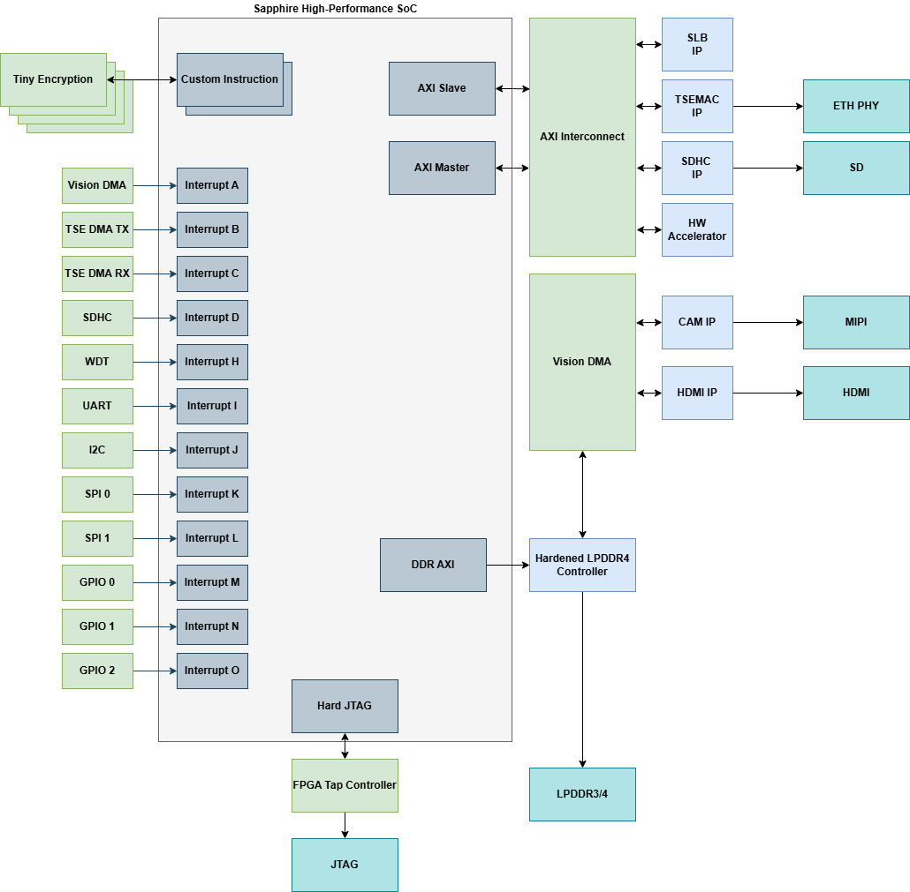

# Sapphire SoC Embedded Solution

Welcome to the Sapphire SoC Embedded Solution repo.

- [Overview](#overview)
- [Sapphire Soc Embedded Solution Hardware Settings](#sapphire-soc-embedded-solution-hardware-settings)
- [Directory structure of Sapphire Soc Embedded Solution](#directory-structure-of-sapphire-soc-embedded-solution)
- [Software Requirements](#software-requirements)
- [Getting Start](#getting-start)
    - [Installing USB Drivers](docs/hardware/setup_drivers.md)
    - [Setting up the development kit](#setting-up-the-development-kit)
    - [Setup Development Board: Titanium Ti375C529](docs/hardware/setup_devkit_Ti375C529.md)
    - [Setup Development Board: Titanium Ti180J484](docs/hardware/setup_devkit_Ti180J484.md)
    - [Setup Development Board: Trion T120F576](docs/hardware/setup_devkit_T120F576.md)
    - [Setting up software folder](#setting-up-software-folder-for-each-devices)
- [Embedded Solution Platform - RTL](#embedded-solution-platform---rtl)
    - [RTL: Design Description](docs/rtl/rtl-design-description.md)
    - [RTL: How to expand the platform](docs/rtl/platform-expansion.md)
- [Embedded Solution Platform - SW](#embedded-solution-platform---sw)
    - [SW: Regenerate Soc](docs/soc/regenerate_soc.md)
    - [SW: Address Mapping](docs/soc/addr_mapping_soc.md)
    - [SW: Supported App List](docs/app/ug_supported_app.md)
- [Linux Boot Up](https://github.com/Efinix-Inc/br2-efinix)
- [Documentation](#documentation)

## Overview

### Sapphire Soc Embedded Solution Platform

The Sapphire Soc Embedded Solution platform is designed to support a diverse range of applications, particularly focusing on vision applications with integrated camera and display design. 
It is compatible with both Titanium and Trion devices, ensuring flexibility and high performance. Key features include support Triple-Speed Ethernet MAC, providing high-speed Ethernet support. This platform offers a comprehensive suite of applications for embedded software, making it suitable for various use cases. This platform supports both Sapphire SoC as well as High-Performance Sapphire SoC. 

#### Sapphire SoC Top Module Block Diagram


#### High-Performance Sapphire SoC Top Module Block Diagram



Key Features:
* Unified RTL Design.
* Support Camera & Display Design for Vision Applications: Optimized for vision-based applications, providing enhanced capabilities for image processing and analysis.
* Support Titanium and Trion Devices: Ensures compatibility and flexibility with different hardware devices, catering to a broad spectrum of applications.
* Support Triple-Speed Ethernet MAC: Provides high-speed Ethernet support, essential for applications requiring fast data transmission.
* Wide Range of Applications for Embedded Software: Offers extensive support for various embedded software applications, making it versatile for numerous embedded system projects.
* Linux Support for Titanium Device (Ti375 & Ti180)
* FreeRTOS Support for all devices.


Available Embedded Software Demo:
- [Ethernet](docs/app/ug_ethernet.md)
  - [x] [lwipIperfServer](docs/app/ug_ethernet.md#lwipiperfserver)
- [Filesystem](docs/app/ug_filesystem.md)
  - [x] [FatFsdemo](docs/app/ug_filesystem.md#fatfsdemo)
- [Sensors](docs/app/ug_sensors.md)
  - [x] [rtcDemo-DS3231](docs/app/ug_sensors.md#rtcdemo-ds3231)
  - [x] [rtcDemo-PCF8523](docs/app/ug_sensors.md#rtcdemo-rtcDemo-pcf8523)
  - [x] [temperatureSensorDemo-EMC1413](docs/app/ug_sensors.md#temperatureSensorDemo-emc1413)
- [Vision](docs/app/ug_vision.md)
  - [x] [cam_display_demo](docs/app/ug_vision.md#cam_display_demo)
  - [x] [cam_display_uart_control_demo](docs/app/ug_vision.md#cam_display_uart_control_demo)
  - [x] [cam_display_sw_control_demo](docs/app/ug_vision.md#cam_display_sw_control_demo)
  - [x] [cam_display_simulation](docs/app/ug_vision.md#cam_display_simulation)
  - [x] [cam_display_profiling](docs/app/ug_vision.md#cam_display_profiling)
  - [x] [cam_display_iperf_demo](docs/app/ug_vision.md#_cam_display_iperf_demo)
- [FreeRTOS](docs/app/ug_freertos.md)
  - [x] [freertosIperfDemo](docs/app/ug_freertos.md#freertosiperfdemo)
  - [x] [freertosMqttPlainTextDemo](docs/app/ug_freertos.md#freertosmqttplaintextdemo)
  - [x] [freertosEchoServerDemo](docs/app/ug_freertos.md#freertosechoserverdemo)
  - [x] [freertosFatDemo](docs/app/ug_freertos.md#freertosfatdemo)


## Sapphire Soc Embedded Solution Hardware Settings

### Sapphire SoC CPU setting:
- 2 Cores
- IMACFD enabled
- Hard standard debug tap
- 128 bits EMIF
- 2KB OCR
- Custom Instruction

### High-Performance Sapphire SoC CPU setting:
- Quad 32-bit 6 stages pipelines RISC-V cores
- support RISC-V WIACFD extenstion
- Support RISC-V debug specification with 8 hardware breakpoints
- Support machine and supervisor priviledge mode
- Support Linux MMU SV32 page-based virtual memory
- Dedicated FPLI for each core
- 4 ways 16KB data and instruction caches
- 16KB on-chip RAM
- 24 bits user interrupts
- 1x 256MB of 32 bits AX14 slave interface
- 1x 3.7GB of 512 bits external memory interface
- 1x 128 bits AX14 master interface
- 1x set local interrupt controller and timer

### Interfaces:
- 1 SD host controller
- 1 MIPI camera + 1 HDMI
- 1 Ethernet
- 2\*SPI + 3\*I2C + UART + 4 pins GPIO + 2\*user timers

### Supported boards:
- Efinix Trion T120F576 Development Board
- Efinix Titanium Ti180J484 Development Board
- Efinix Titanium Ti375C529 Development Board - High-Performance SoC


**Note:**
- Below are some difference in terms of cpu setting between supported devices.

| Device       | System Clk (MHz) | Peripheral Clk (MHz)| Memory Clk (MHz) |      Cache Setting     |
|--------------|------------------|---------------------|------------------|------------------------|
| Ti375C529    |      1000         |         200         |       200        |4 ways 16kb I & D caches|
| Ti180J484    |      200         |         200         |       125        |8 ways 32kb I & D caches|
| T120F576     |       50         |          50         |        50        |2 ways 8kb I & D caches |

- Linux Memory Management Unit (MMU) is disabled for Trion T120F576. 
- Both the Ti180J484 & Ti375C529 devices support Linux Boot-up.
- The resolution of the display is set to 720p for the soft sapphire soc devices (Ti180J484 & T120F576) while 1080p for Ti375C529 (High Performance Sapphire Soc Device) .


### Resource Consumption

| Device       | XLR              | Memory Block | DSP Block /Multiplier |
|--------------|------------------|---------------------|------------------|
| T120F576    |      78815/112128         |         693/1056         |       17/320 (Multiplier*)       |
| Ti180J484    |      87314/172800         |        729/1280         |       17/640       |
| Ti375C529     |       48967/ 362880         |          228/2688         |        0/1344       |

## Directory structure of Sapphire Soc Embedded Solution

```
  +---common
  ¦   +---embedded_sw
  ¦       +---software
  ¦           +---ethernet
  ¦           ¦   +---lwipIperfServer
  ¦           +---filesystem
  ¦           ¦   +---fatFSDemo
  ¦           +---freeRTOS
  ¦           ¦   +---common
  ¦           ¦   +---driver
  ¦           ¦   +---freertosDemo
  ¦           ¦   +---freertosDemo2
  ¦           ¦   +---freertosEchoServerDemo
  ¦           ¦   +---freertosFatDemo
  ¦           ¦   +---freertosIperfDemo
  ¦           ¦   +---freertosMqttPlainTextDemo
  ¦           ¦   +---freertosUartInterruptDemo
  ¦           +---sensors
  ¦           ¦   +---rtcDemo-DS3231
  ¦           ¦   +---rtcDemo-PCF8523
  ¦           ¦   +---temperatureSensorDemo-EMC1413
  ¦           +---standalone
  ¦           ¦   +---apb3
  ¦           ¦   ¦   +---apb3Demo
  ¦           ¦   +---application
  ¦           ¦   ¦   +---coremark
  ¦           ¦   ¦   +---dhrystone
  ¦           ¦   ¦   +---memTest
  ¦           ¦   +---bootloader
  ¦           ¦   +---common
  ¦           ¦   +---compatibilityDemo
  ¦           ¦   +---customInstruction
  ¦           ¦   ¦   +---customInstructionDemo
  ¦           ¦   +---driver
  ¦           ¦   ¦   +---device
  ¦           ¦   +---fpu
  ¦           ¦   ¦   +---fpuDemo
  ¦           ¦   +---gpio
  ¦           ¦   ¦   +---gpioDemo
  ¦           ¦   +---i2c
  ¦           ¦   ¦   +---i2cDemo
  ¦           ¦   ¦   +---i2cMasterDemo
  ¦           ¦   ¦   +---i2cSlaveDemo
  ¦           ¦   +---inlineAsmDemo
  ¦           ¦   +---openocdServer
  ¦           ¦   +---sdhc
  ¦           ¦   ¦   +---sdhcDemo
  ¦           ¦   +---smp
  ¦           ¦   ¦   +---smpDemo
  ¦           ¦   +---spi
  ¦           ¦   ¦   +---spiDemo
  ¦           ¦   +---timer
  ¦           ¦   ¦   +---coreTimerInterruptDemo
  ¦           ¦   ¦   +---nestedInterruptDemo
  ¦           ¦   ¦   +---userTimerDemo
  ¦           ¦   +---uart
  ¦           ¦   ¦   +---uartEchoDemo
  ¦           ¦   ¦   +---uartInterruptDemo
  ¦           ¦   +---vexriscv
  ¦           ¦       +---dCacheFlushDemo
  ¦           ¦       +---iCacheFlushDemo
  ¦           ¦       +---semihostingDemo
  ¦           +---vision
  ¦               +---cam_display_demo
  ¦               +---cam_display_uart_control_demo
  ¦               +---cam_display_sw_control_demo
  ¦               +---cam_display_simulation
  ¦               +---cam_display_profiling
  ¦               +---cam_display_iperf_demo
  +---hps_soc
  ¦   +---common
  ¦   ¦   +---submodules
  ¦   ¦       +---common
  ¦   ¦       +---hdmi_display
  ¦   ¦       ¦   +---common
  ¦   ¦       ¦   +---display
  ¦   ¦       ¦   ¦   +---box_annotator
  ¦   ¦       ¦   ¦   +---hdmi
  ¦   ¦       ¦   +---display_dma_fifo
  ¦   ¦       +---hw_accel
  ¦   ¦       ¦   +---hw_accel
  ¦   ¦       ¦   +---hw_accel_dma_in_fifo
  ¦   ¦       ¦   +---hw_accel_dma_out_fifo
  ¦   ¦       +---mipi_csi_cam
  ¦   ¦           +---cam_dma_fifo
  ¦   ¦           +---cam_pixel_remap_fifo
  ¦   ¦           +---common
  ¦   +---Ti375C529_devkit
  ¦       +---embedded_sw
  ¦       ¦   +---efx_hard_soc
  ¦       ¦       +---bsp
  ¦       ¦           +---efinix
  ¦       ¦               +---EfxSapphireSoc
  ¦       ¦                   +---app
  ¦       ¦                   ¦   +---fatfs
  ¦       ¦                   ¦   +---lwip
  ¦       ¦                   ¦   +---vision
  ¦       ¦                   +---include
  ¦       ¦                   +---lauterbach_trace32
  ¦       ¦                   +---linker
  ¦       ¦                   +---openocd
  +---sapphire_soc
      +---common
      ¦   +---submodules
      ¦       +---cam
      ¦       +---common
      ¦       +---hdmi_display
      ¦       +---hw_accel
      +---T120F576_devkit
      ¦   +---embedded_sw
      ¦   ¦   +---EfxSapphireSoc
      ¦   ¦       +---bsp
      ¦   ¦       +---config
      ¦   ¦       +---config_linux
      ¦   ¦       +---tool
      +---Ti180J484_devkit
          +---embedded_sw
          ¦   +---EfxSapphireSoc
          ¦       +---bsp
          ¦       +---config
          ¦       +---config_linux
          ¦       +---tool
```

## Software Requirements

### Efinity Software Version 

- [Efinity v2024.1.163](https://www.efinixinc.com/support/efinity.php) 

- Follow the official [documentation](https://www.efinixinc.com/docs/efinity-installation-v3.3.pdf) on installation process.

### Efinity Patch Version

- Tested with [Efinity Patch v2024.1.163.3.13](https://www.efinixinc.com/support/efinity.php) (Released on 9th September 2024)

### Efinity RISC-V Embedded Software IDE

- [v2024.1](https://www.efinixinc.com/support/efinity.php) and above

- Follow the official [documentation](https://www.efinixinc.com/docs/riscv-sapphire-ug-v6.1.pdf) on installation process 

- Learn more at the [official website](https://www.efinixinc.com/products-efinity-riscv-ide.html)

### Additional Software needed for ethernet-related demo
- [iperf2](https://iperf.fr/download/windows/iperf-2.0.9-win64.zip)
- [iPerf3](https://iperf.fr/download/windows/iperf-3.1.3-win64.zip)
- [EchoTool](https://github.com/pbansky/EchoTool/releases/download/v1.5.0.0/echotool.exe)
- [Mosquitto](https://mosquitto.org/download/)

## Getting Start

### Setting up the development kit

* [Setup Development Board: Titanium Ti180J484](docs/hardware/setup_devkit_Ti180J484.md)

* [Setup Development Board: Trion T120F576](docs/hardware/setup_devkit_T120F576.md)

* [Setup Development Board: Titanium Ti375C529](docs/hardware/setup_devkit_Ti375C529.md)


### Setting up software folder 

1. Git clone / download from the release.
2. Users are required to run the [setup.py](setup.py) once in the terminal to copy over the application to the device specific BSP folder. 
3. Type the command:

    `` python3 setup.py  ``

Users should see output similar to the following in the terminal:


Note: Please refer [List of supported app](docs/app/ug_supported_app.md) for different devices. 

## Embedded Solution Platform - RTL

* [RTL: Design Description](docs/rtl/rtl-design-description.md)
* [RTL: How to expand the platform](docs/rtl/platform-expansion.md)

## Embedded Solution Platform - SW
* [SW: Regenerate Soc](docs/soc/regenerate_soc.md)
* [SW: Address Mapping](docs/soc/addr_mapping_soc.md)
* [SW: Supported App List](docs/app/ug_supported_app.md)

## Documentation
- [Efinity Programmer User Guide](https://www.efinixinc.com/support/docsdl.php?s=ef&pn=UG-EFN-PGM)
- [Sapphire RISC-V SoC Datasheet](https://www.efinixinc.com/support/docsdl.php?s=ef&pn=SAPPHIREDS)
- [Sapphire RISC-V SoC Hardware and Software User Guide](https://www.efinixinc.com/support/docsdl.php?s=ef&pn=SAPPHIREUG)
- [HPS RISC-V SoC Datasheet](https://www.efinixinc.com/support/docsdl.php?s=ef&pn=SAPPHIREHPBDS)
- [HPS RISC-V SoC Hardware and Software User Guide](https://www.efinixinc.com/support/docsdl.php?s=ef&pn=SAPPHIREHPBUG)
- [Trion T120 BGA576 Development Kit User Guide](https://www.efinixinc.com/support/docsdl.php?s=ef&pn=T120F576-DK-UG)
- [Titanium Ti180 J484 Development Kit User Guide](https://www.efinixinc.com/support/docsdl.php?s=ef&pn=Ti180J484-DK-UG)
- [Titanium Ti375C529 Development Kit User Guide](https://www.efinixinc.com/support/docsdl.php?s=ef&pn=Ti375C529-DK-UG)
- [Titanium Ti375C529 Development Kit Schematics](https://www.efinixinc.com/support/docsdl.php?s=ef&pn=TI375C529-BRD-SCHM)
