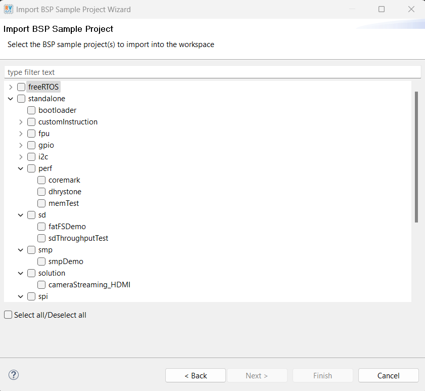

# Embedded System Solution Hub

Welcome to the Embedded System Solution Hub.

- [Overview](#overview)
- [Embedded System Solution Hardware Settings](#embedded-system-solution-hardware-settings)
- [Directory structure of Embedded System Solution](#directory-structure-of-embedded-system-solution)
- [Software Requirements](#software-requirements)
- [Getting Start](#getting-start)
    - [Installing USB Drivers](docs/hardware/setup_drivers.md)
    - [Setup Development Board: Titanium Ti375C529](docs/hardware/setup_devkit_Ti375C529.md)
     - [Setting up firmware folder](#setting-up-firmware-folder)
- [Embedded Solution Platform - RTL](#embedded-solution-platform---rtl)
    - [RTL: How to disable exisiting IP](docs/rtl/rtl-disable-ip.md)
    - [RTL: How to expand the platform](docs/rtl/platform-expansion.md)
- [Embedded Solution Platform - SW](#embedded-solution-platform---sw)
    - [SW: Address Mapping](docs/soc/addr_mapping_soc.md)
    - [SW: Supported App List](docs/app/ug_supported_app.md)
- [Linux Boot Up](https://github.com/Efinix-Inc/br2-efinix)
- [Documentation](#documentation)

## Overview

### Embedded System Solution Platform

The Embedded Solution platform is designed to support a diverse range of applications, particularly focusing on vision applications with integrated camera and display design. 
It is compatible with both Titanium and Trion devices, ensuring flexibility and high performance. Key features include support Triple-Speed Ethernet MAC, providing high-speed Ethernet support. This platform offers a comprehensive suite of applications for embedded software, making it suitable for various use cases. This platform supports both Sapphire SoC as well as High-Performance Sapphire SoC. 


#### High-Performance Sapphire SoC Top Module Block Diagram


Key Features:
* Unified RTL Design.
* Support Camera & Display Design for Vision Applications: Optimized for vision-based applications, providing enhanced capabilities for image processing and analysis.
* Support Titanium and Trion Devices: Ensures compatibility and flexibility with different hardware devices, catering to a broad spectrum of applications.
* Support Triple-Speed Ethernet MAC: Provides high-speed Ethernet support, essential for applications requiring fast data transmission.
* Wide Range of Applications for Embedded Software: Offers extensive support for various embedded software applications, making it versatile for numerous embedded system projects.
* Linux Support for Titanium Device (Ti375 & Ti180)
* FreeRTOS Support for all devices.


Available Embedded Software Demo:
- [Tsemac](docs/app/ug_ethernet.md)
  - [x] [lwipIperfServer](docs/app/ug_ethernet.md#lwipiperfserver)
- [Sensors](docs/app/ug_sensors.md)
  - [x] [sensor_DS3231_rtc](docs/app/ug_sensors.md#sensor_DS3231_rtc)
  - [x] [sensor_PCF8523_rtc](docs/app/ug_sensors.md#rtcdemo-sensor_PCF8523_rtc)
  - [x] [sensor_EMC1413_temp](docs/app/ug_sensors.md#sensor_EMC1413_temp)
- [Solution](docs/app/ug_solution.md)
  - [x] [cameraStreaming_HDMI](docs/app/ug_solution.md#cameraStreaming_HDMI)
  - [x] [sd_bmpStreaming_HDMI](docs/app/ug_solution.md#sd_bmpStreaming_HDMI)
- [FreeRTOS](docs/app/ug_freertos.md)
  - [x] [freertosIperfDemo](docs/app/ug_freertos.md#freertosiperfdemo)
  - [x] [freertosMqttPlainTextDemo](docs/app/ug_freertos.md#freertosmqttplaintextdemo)
  - [x] [freertosEchoServerDemo](docs/app/ug_freertos.md#freertosechoserverdemo)
  - [x] [freertosFatDemo](docs/app/ug_freertos.md#freertosfatdemo)


## Embedded System Solution Hardware Settings

### High-Performance Sapphire SoC CPU setting:
- Quad 32-bit 6 stages pipelines RISC-V cores
- support RISC-V WIACFD extenstion
- Support RISC-V debug specification with 8 hardware breakpoints
- Support machine and supervisor priviledge mode
- Support Linux MMU SV32 page-based virtual memory
- Dedicated FPLI for each core
- 4 ways 16KB data and instruction caches
- 16KB on-chip RAM
- 24 bits user interrupts
- 1x 256MB of 32 bits AX14 slave interface
- 1x 3.7GB of 512 bits external memory interface
- 1x 128 bits AX14 master interface
- 1x set local interrupt controller and timer

### Interfaces:
- 1 SD host controller
- 1 MIPI camera + 1 HDMI
- 1 Ethernet
- 2\*SPI + 3\*I2C + UART + 4 pins GPIO + 2\*user timers


**Note:**
- The resolution of the display is set to 1080p for Ti375C529 device.
- Below are some difference in terms of cpu setting between supported devices.

| Device       | System Clk (MHz) | Peripheral Clk (MHz)| Memory Clk (MHz) |      Cache Setting     |
|--------------|------------------|---------------------|------------------|------------------------|
| Ti375C529    |      1000         |         200         |       200        |4 ways 16kb I & D caches|
| Ti180J484    |      200         |         200         |       125        |8 ways 32kb I & D caches|
| T120F576     |       50         |          50         |        50        |2 ways 8kb I & D caches |


### Resource Consumption

| Device       | XLR              | Memory Block | DSP Block /Multiplier |
|--------------|------------------|---------------------|------------------|
| T120F576    |      78815/112128         |         693/1056         |       17/320 (Multiplier*)       |
| Ti180J484    |      87314/172800         |        729/1280         |       17/640       |
| Ti375C529     |       48967/ 362880         |          228/2688         |        0/1344       |

## Directory structure of Embedded System Solution

```
  +---embedded_sw
  ¦     +---embedded_solution
  ¦       +---bsp
  ¦       ¦    +---efinix
  ¦       ¦        +---EfxSapphireSoc
  ¦       ¦            +---app
  ¦       ¦            ¦   +---fatfs
  ¦       ¦            ¦   +---lwip
  ¦       ¦            +---include
  ¦       ¦            +---lauterbach_trace32
  ¦       ¦            +---linker
  ¦       ¦            +---openocd
  ¦       +---software
  ¦           +---freeRTOS
  ¦           ¦   +---common
  ¦           ¦   +---driver
  ¦           ¦   +---freertosDemo
  ¦           ¦   +---freertosEchoServerDemo
  ¦           ¦   +---freertosFatDemo
  ¦           ¦   +---freertosIperfDemo
  ¦           ¦   +---freertosMqttPlainTextDemo
  ¦           +---standalone 
  ¦           ¦   +---bootloader
  ¦           ¦   +---common
  ¦           ¦   +---customInstruction
  ¦           ¦   ¦   +---customInstructionDemo
  ¦           ¦   +---driver
  ¦           ¦   +---fpu
  ¦           ¦   ¦   +---fpuDemo
  ¦           ¦   +---gpio
  ¦           ¦   ¦   +---gpioDemo
  ¦           ¦   +---i2c
  ¦           ¦   ¦   +---sensor_PCF8523_rtc
  ¦           ¦   ¦   +---sensor_EMC1413_temp
  ¦           ¦   +---perf
  ¦           ¦   ¦   +---coremark
  ¦           ¦   ¦   +---dhrystone
  ¦           ¦   ¦   +---memTest
  ¦           ¦   +---sd
  ¦           ¦   ¦   +---sdThroughputTest
  ¦           ¦   +---smp
  ¦           ¦   ¦   +---smpDemo
  ¦           ¦   +---spi
  ¦           ¦   ¦   +---spiDemo
  ¦           ¦   +---timer
  ¦           ¦   ¦   +---clintTimerInterruptDemo
  ¦           ¦   ¦   +---userTimerDemo
  ¦           ¦   ¦   +---watchdogDemo
  ¦           ¦   +---uart
  ¦           ¦   ¦   +---uartEchoDemo
  ¦           ¦   ¦   +---uartInterruptDemo
  ¦           +---tsemac
  ¦           ¦   +---lwipIperfServer
  ¦           +---solution
  ¦               +---cameraStreaming_HDMI
  ¦               +---sd_bmpStreaming_HDMI
  +---source
  ¦   +---submodules
  ¦        +---cam
  ¦        +---common               
  ¦        +---hdmi_display
  ¦        ¦   +---display
  ¦        ¦       +---mif_yuv
  ¦        +---hw_accel         

```

## Software Requirements

### Efinity Software Version 

- [Efinity 2024.2.294.1.19](https://www.efinixinc.com/support/efinity.php) [v2024.2 Patch 1]

- Follow the official [documentation](https://www.efinixinc.com/docs/efinity-installation-v3.3.pdf) on installation process.

### Efinity RISC-V Embedded Software IDE

- [v2024.2](https://www.efinixinc.com/support/efinity.php) and above

- Follow the official [documentation](https://www.efinixinc.com/docs/riscv-sapphire-ug-v6.1.pdf) on installation process 

- Learn more at the [official website](https://www.efinixinc.com/products-efinity-riscv-ide.html)

### Additional Software needed for ethernet-related demo
- [iperf2](https://iperf.fr/download/windows/iperf-2.0.9-win64.zip)
- [iPerf3](https://iperf.fr/download/windows/iperf-3.1.3-win64.zip)
- [EchoTool](https://github.com/pbansky/EchoTool/releases/download/v1.5.0.0/echotool.exe)
- [Mosquitto](https://mosquitto.org/download/)

## Getting Start

### Setting up the development kit

* [Setup Development Board: Titanium Ti375C529](docs/hardware/setup_devkit_Ti375C529.md)


### Setting up firmware folder 

1. Git clone / download from the release.
2. Type command on terminal to switch branch :

    ```
    git checkout Ti375C529
    ```
    
2. By launching [Efinity RISC-V Embedded Software IDE](https://www.efinixinc.com/support/efinity.php), users are required to import the [bsp](embedded_sw/efx_solution/bsp) shown below:
<br> 

3. Once the BSP is selected, available BSP project can be imported to the workspace. <br>



Note: Please refer [List of supported app](docs/app/ug_supported_app.md) for different devices. 

## Embedded Solution Platform - RTL

* [RTL: How to disable exisiting IP](docs/rtl/rtl-disable-ip.md)
* [RTL: How to expand the platform](docs/rtl/platform-expansion.md)

## Embedded Solution Platform - SW
* [SW: Address Mapping](docs/soc/addr_mapping_soc.md)
* [SW: Supported App List](docs/app/ug_supported_app.md)

## Documentation
- [Efinity Programmer User Guide](https://www.efinixinc.com/support/docsdl.php?s=ef&pn=UG-EFN-PGM)
- [HPS RISC-V SoC Datasheet](https://www.efinixinc.com/support/docsdl.php?s=ef&pn=SAPPHIREHPBDS)
- [HPS RISC-V SoC Hardware and Software User Guide](https://www.efinixinc.com/support/docsdl.php?s=ef&pn=SAPPHIREHPBUG)
- [Titanium Ti375C529 Development Kit User Guide](https://www.efinixinc.com/support/docsdl.php?s=ef&pn=Ti375C529-DK-UG)
- [Titanium Ti375C529 Development Kit Schematics](https://www.efinixinc.com/support/docsdl.php?s=ef&pn=TI375C529-BRD-SCHM)
