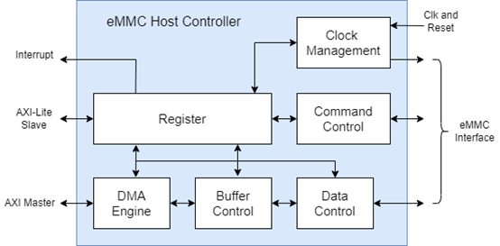
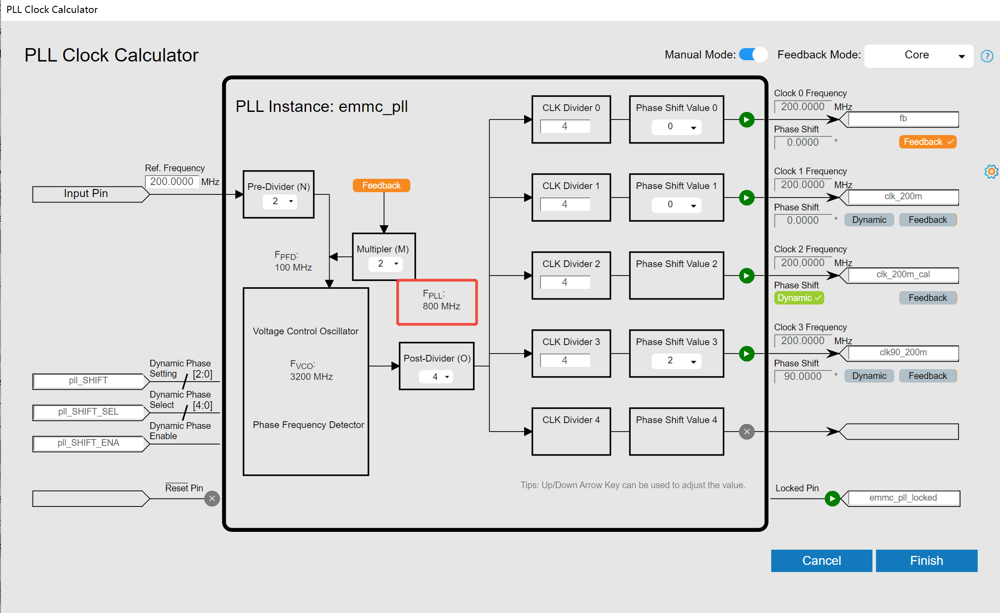
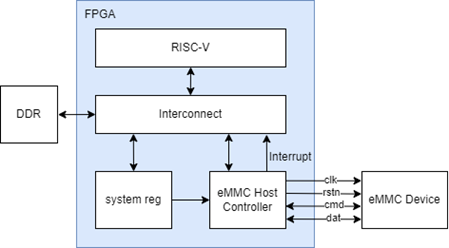
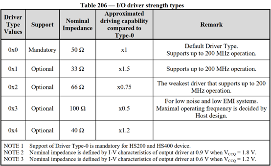
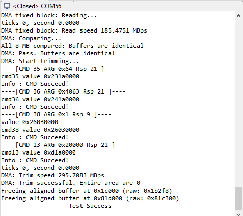

# eMMC Host Controller User Guide

## Contents

*   **[1 Important Note](#1-important-note)**
*   **[2 Introduction](#2-introduction)**
*   **[3 Features](#3-features)**
*   **[4 Functional Description](#4-functional-description)**
    *   [4.1 Initialization](#41-initialization)
    *   [4.2 Block Read Operation](#42-block-read-operation)
    *   [4.3 Block Write Operation](#43-block-write-operation)
    *   [4.4 ADMA transfer](#44-adma-transfer)
*   **[5 Parameter Configuration](#5-parameter-configuration)**
    *   [5.1 SHIFT_SEL](#51-shift_sel)
*   **[6 Resource Utilization](#6-resource-utilization)**
*   **[7 Interface Description](#7-interface-description)**
    *   [7.1 System Signal](#71-system-signal)
    *   [7.2 Phase Adjustment Signal](#72-phase-adjustment-signal)
    *   [7.3 AXI4-Lite Interface Signal](#73-axi4-lite-interface-signal)
    *   [7.4 AXI4 Interface Signal](#74-axi4-interface-signal)
    *   [7.5 eMMC Interface Signal](#75-emmc-interface-signal)
*   **[8 Register Space](#8-register-space)**
    *   [8.1 Version (0x000)](#81-version-0x000)
    *   [8.2 Base Register 0 (0x004)](#82-base-register-0-0x004)
    *   [8.3 Base Status Register 0 (0x008)](#83-base-status-register-0-0x008)
    *   [8.4 Base Register 1 (0x00C)](#84-base-register-1-0x00c)
    *   [8.5 Argument 2 Register (0x100)](#85-argument-2-register-0x100)
    *   [8.6 Block Size Register (0x104)](#86-block-size-register-0x104)
    *   [8.7 Argument 1 Register (0x108)](#87-argument-1-register-0x108)
    *   [8.8 Transfer Mode Register (0x10C)](#88-transfer-mode-register-0x10c)
    *   [8.9 Command Response Register0 (0x110)](#89-command-response-register0-0x110)
    *   [8.10 Command Response Register1 (0x114)](#810-command-response-register1-0x114)
    *   [8.11 Command Response Register2 (0x118)](#811-command-response-register2-0x118)
    *   [8.12 Command Response Register3 (0x11C)](#812-command-response-register3-0x11c)
    *   [8.13 Buffer Data Port Register (0x120)](#813-buffer-data-port-register-0x120)
    *   [8.14 Present State Register (0x124)](#814-present-state-register-0x124)
    *   [8.15 Host Control Register (0x128)](#815-host-control-register-0x128)
    *   [8.16 Interrupt Status Register (0x130)](#816-interrupt-status-register-0x130)
    *   [8.17 Interrupt Status Enable Register (0x134)](#817-interrupt-status-enable-register-0x134)
    *   [8.18 Interrupt Signal Enable Register (0x138)](#818-interrupt-signal-enable-register-0x138)
    *   [8.19 Host Capabilities Register (0x140)](#819-host-capabilities-register-0x140)
    *   [8.20 ADMA System Address Register (0x158)](#820-adma-system-address-register-0x158)
    *   [8.21 ADMA System Address Register (0x15C)](#821-adma-system-address-register-0x15c)
*   **[9 Example Design Description](#9-example-design-description)**
    *   [9.1 Block Diagram](#91-block-diagram)
    *   [9.2 System Register](#92-system-register)
*   **[10 Driver Description](#10-driver-description)**
    *   [10.1 User Parameter](#101-user-parameter)
    *   [10.2 Functions](#102-functions)
    *   [10.3 Test Function](#103-test-function)
*   **[11 Usage](#11-usage)**

---

## 1. Important Note

This eMMC host controller only implements a subset of eMMC version 5.1. Essential operations such as read/write/erase/trim are supported. It supports HS200 SDR x4/x8, HS400 DDR x8, and frequency up to 200MHz.

## 2. Introduction

The eMMC Host Controller is a standard storage controller for accessing embedded multimedia cards (eMMC), and its basic functional block diagram is shown below.

> **Figure 1:** eMMC Host Controller General Block Diagram

*   **Clock Management:** Generate clock to eMMC device.
*   **Command Control:** Sends commands and receives responses from eMMC devices.
*   **Data Control:** Sends data from the host and receives data from the eMMC device.
*   **Buffer Control:** Caches data sent by the host and read data responded by the eMMC device.
*   **DMA Engine:** Implements the ADMA data transfer protocol.
*   **Register:** Contains control registers of eMMC host controller, response registers of eMMC device.

## 3. Features

**Table 1: Supported Mode Table**

| Mode | Data Rate | Bus Width | Frequency |
| :--- | :--- | :--- | :--- |
| HS200 | Single | 4/8 | 0~200MHz (2) |
| HS400 (1) | Dual | 8 | 0~200MHz (2) |

*   Supports ADMA and non-ADMA (3) data transfer.
*   Supports single and multi-block data transfer.
*   Supports commands and data CRC checksums.
*   Supports interrupts such as command completion, data transfer completion, command timeout error, command checksum error, command parameter error, data checksum error, etc.
*   AXI4-lite interface for register configuration, AXI4 interface for data transfer.

> **Note 1:** Only eMMC chips that support CMD21 commands in HS400 mode are supported.
> **Note 2:** Supports 200 MHz and its even sub-frequencies.
> **Note 3:** non-ADMA refers to data transfer via register reads and writes.

## 4. Functional Description

### 4.1 Initialization

During the power-up process, the eMMC Host Controller must go through the initialization and device identification process before data transmission. During the device identification process, the eMMC Host Controller needs to read the basic information of the eMMC device (including information such as OCR register, CID number, CSD register, etc.), and it also needs to assign a relative address to the eMMC device, and at the same time ensure that the eMMC device is ready to be accessed.

### 4.2 Block Read Operation

The eMMC Host Controller supports single block read and multi-block read operations and supports a maximum block length of 512 bytes.
For single block read, `CMD17` (READ_SINGLE_ BLOCK) command is sent to the eMMC device.
For multi-block read, `CMD18` (READ_MULTIPLE_BLOCK) command is sent to the eMMC device as a start indication, and then consecutive blocks are received, and finally `CMD12` (STOP_ TRANSMISSION) command as a stop transmission indication.

### 4.3 Block Write Operation

The eMMC Host Controller supports single block write and multi-block write operations, and the maximum block length supported is 512 bytes.
For single block write, send `CMD24` (WRITE_BLOCK) command to eMMC device.
For multi-block write, send `CMD25` (WRITE_MULTIPLE_BLOCK) command to the eMMC device as a start indication, then write data blocks continuously, and finally send `CMD12` (STOP_ TRANSMISSION) command to stop the transmission.

### 4.4 ADMA transfer

The eMMC Host Controller supports Advanced Direct Memory Access (ADMA) data transfers, which are generally used in situations where large amounts of data are being moved.
First, users need to create a descriptor list in the system memory, each descriptor can transfer up to 65536 bytes, if you need to transfer more data, you need to create more descriptors. After creating the descriptor list, start ADMA, the eMMC Host Controller automatically fetches the descriptors from the system memory and starts the data transfer.
The last descriptor must contain a stop bit message to indicate that it is the last data to be transferred. When the last descriptor is executed and the data transfer is complete, ADMA generates an interrupt to the CPU.

## 5. Parameter Configuration

**Table 2: IP User Parameter Definitions**

| Parameter | Value | Description |
| :--- | :--- | :--- |
| `ADMA_DATA_WIDTH` | 32/64/128/256/512 | AXI master interface data width |
| `BASE_CLK_FREQ` | 200 | Frequency of `emmc_base_clk`, unit in MHz |
| `SHIFT_SEL` | 0x4 | Dynamic phase shift setting for `emmc_pll` |

### 5.1 SHIFT_SEL

As shown in the figure below, if the output clock Clock N is set to Dynamic Phase Shift, the bit N of input `SHIFT_SEL[4:0]` should be 1.
In the example design project, `clk_200m_cal` corresponds to the clock output port 2 and is set to Dynamic Phase Shift, so the value of `SHIFT_SEL[4:0]` is `5'b00100`, i.e., `5'h4`.
If there is a change in the corresponding clock output port of `clk_200m_cal`, then the value of `SHIFT_SEL[4:0]` should be changed accordingly.

> **Figure 2:** eMMC PLL settings

## 6. Resource Utilization

The design is compiled with software version Efinity 2025.2.288, `ADMA_DATA_WIDTH` configured to 128, and eMMC System Register and Host Controller resource utilization are as shown in the table below:

**Table 3: eMMC System Register Resource utilization**

| FFs | SRLs | ADDs | LUTs | COMB4s | RAMs | DSP/MULTs |
| :---: | :---: | :---: | :---: | :---: | :---: | :---: |
| 122 | 0 | 0 | 53 | 0 | 0 | 0 |

**Table 4: eMMC Host Controller Resource utilization**

| FFs | SRLs | ADDs | LUTs | COMB4s | RAMs | DSP/MULTs |
| :---: | :---: | :---: | :---: | :---: | :---: | :---: |
| 4595 | 0 | 565 | 4627 | 0 | 15 | 0 |

## 7. Interface Description

### 7.1 System Signal

| Name | Direction | Description |
| :--- | :--- | :--- |
| `emmc_rst` | Input | Global reset (active high). |
| `emmc_base_clk` | Input | Base clock. |
| `emmc_base_clk_cal` | Input | Same frequency as `emmc_base_clk`, phase can be dynamically adjusted. |
| `s_axi_aclk` | Input | AXI4-Lite clock. |
| `m_axi_clk` | Input | AXI4 clock. |
| `emmc_int` | Output | Interrupt signal |

### 7.2 Phase Adjustment Signal

| Name | Direction | Description |
| :--- | :--- | :--- |
| `pll_SHIFT[2:0]` | Output | Dynamic phase shift control for PLL. |
| `pll_SHIFT_SEL[4:0]` | Output | Phase shift selection. |
| `pll_SHIFT_ENA` | Output | Phase shift enable. |

### 7.3 AXI4-Lite Interface Signal

| Name | Direction | Description |
| :--- | :--- | :--- |
| `s_axi_awaddr[9:0]` | Input | AXI4-Lite write address bus. |
| `s_axi_awvalid` | Input | AXI4-Lite write address valid strobe. |
| `s_axi_awready` | Output | AXI4-Lite write address ready signal. |
| `s_axi_wdata[31:0]` | Input | AXI4-Lite write data. |
| `s_axi_wstrb[3:0]` | Input | AXI4-Lite write strobe. |
| `s_axi_wvalid` | Input | AXI4-Lite write data valid strobe. |
| `s_axi_wready` | Output | AXI4-Lite write ready signal. |
| `s_axi_bresp[1:0]` | Output | AXI4-Lite write response. |
| `s_axi_bvalid` | Output | AXI4-Lite write response valid strobe. |
| `s_axi_bready` | Input | AXI4-Lite write response ready signal. |
| `s_axi_araddr[9:0]` | Input | AXI4-Lite read address bus. |
| `s_axi_arvalid` | Input | AXI4-Lite read address valid strobe. |
| `s_axi_arready` | Output | AXI4-Lite read address ready signal. |
| `s_axi_rresp[1:0]` | Output | AXI4-Lite read response. |
| `s_axi_rdata[31:0]` | Output | AXI4-Lite read data. |
| `s_axi_rvalid` | Output | AXI4-Lite read data valid strobe. |
| `s_axi_rready` | Input | AXI4-Lite read data ready signal. |

### 7.4 AXI4 Interface Signal

| Name | Direction | Description |
| :--- | :--- | :--- |
| `m_axi_awvalid` | Output | AXI4 write address valid. |
| `m_axi_awaddr[31:0]` | Output | AXI4 write address. |
| `m_axi_awlen[7:0]` | Output | AXI4 write burst length. |
| `m_axi_awsize[2:0]` | Output | AXI4 write burst size. |
| `m_axi_awburst[1:0]` | Output | AXI4 write burst type. |
| `m_axi_awprot[2:0]` | Output | AXI4 write protection type. |
| `m_axi_awlock[1:0]` | Output | AXI4 write lock type. |
| `m_axi_awcache[3:0]` | Output | AXI4 write cache type. |
| `m_axi_awready` | Input | AXI4 write address ready. |
| `m_axi_wdata` `[adma_data_width-1:0]` | Output | AXI4 write data. |
| `m_axi_wstrb` `[adma_data_width/8-1:0]` | Output | AXI4 write strobes. |
| `m_axi_wlast` | Output | AXI4 write last. |
| `m_axi_wvalid` | Output | AXI4 write valid. |
| `m_axi_wready` | Input | AXI4 write ready. |
| `m_axi_bresp[1:0]` | Input | AXI4 write response. |
| `m_axi_bvalid` | Input | AXI4 write response valid. |
| `m_axi_bready` | Output | AXI4 write response ready. |
| `m_axi_arvalid` | Output | AXI4 read address valid. |
| `m_axi_araddr[31:0]` | Output | AXI4 read address |
| `m_axi_arlen [7:0]` | Output | AXI4 read burst length. |
| `m_axi_arsize [2:0]` | Output | AXI4 read burst size. |
| `m_axi_arburst[1:0]` | Output | AXI4 read burst type. |
| `m_axi_arprot[2:0]` | Output | AXI4 read protection type. |
| `m_axi_arlock[1:0]` | Output | AXI4 read lock type. |
| `m_axi_arcache[3:0]` | Output | AXI4 read cache type. |
| `m_axi_arready` | Input | AXI4 read address ready. |
| `m_axi_rvalid` | Input | AXI4 read valid. |
| `m_axi_rdata` `[adma_data_width-1:0]` | Input | AXI4 read data. |
| `m_axi_rlast` | Input | AXI4 read last. |
| `m_axi_rresp [1:0]` | Input | AXI4 read response. |
| `m_axi_rready` | Output | AXI4 read ready. |

### 7.5 eMMC Interface Signal

| Name | Direction | Description |
| :--- | :--- | :--- |
| `emmc_clk_HI` | Output | eMMC clock signal |
| `emmc_clk_LO` | Output | |
| `emmc_cmd_IN_HI` | Input | Command input signal |
| `emmc_cmd_IN_LO` | Input | |
| `emmc_cmd_OUT_HI` | Output | Command output signal |
| `emmc_cmd_OUT_LO` | Output | |
| `emmc_cmd_OE` | Output | Command output enable signal |
| `emmc_dat_IN_HI [7:0]` | Input | Data input signal |
| `emmc_dat_IN_LO [7:0]` | Input | |
| `emmc_dat_OUT_HI[7:0]` | Output | Data output signal |
| `emmc_dat_OUT_LO[7:0]` | Output | |
| `emmc_dat_OE` | Output | Data output enable signal |

## 8. Register Space

**Table 5: Register Attribute Definitions**

| Access Type | Definition |
| :--- | :--- |
| R/W | Readable and writable |
| RC | Read and self-clear |
| RO | Read-only |

### 8.1 Version (0x000)

| Bit | Default Value | Description | Attribute |
| :--- | :--- | :--- | :--- |
| 31-0 | - | Version register | RO |

### 8.2 Base Register 0 (0x004)

| Bit | Default Value | Description | Attribute |
| :--- | :--- | :--- | :--- |
| 31-17 | - | Reserved | - |
| 16 | 1'b0 | Clock Enable. | R/W |
| 15-0 | 16'h0 | Clock divider factor. Valid value is 1 or an even number. | R/W |

### 8.3 Base Status Register 0 (0x008)

| Bit | Default Value | Description | Attribute |
| :--- | :--- | :--- | :--- |
| 31-2 | - | Reserved | - |
| 1 | 1'b0 | Data line is busy: 0: Not Busy 1: Busy | RO |
| 0 | 1'b0 | Command line is busy: 0: Not Busy 1: Busy | RO |

### 8.4 Base Register 1 (0x00C)

| Bit | Default Value | Description | Attribute |
| :--- | :--- | :--- | :--- |
| 31-16 | 16'h0 | Sampling counter, sample_cnt < clk_div | R/W |
| 15-9 | - | Reserved | - |
| 8-6 | 3'h0 | Phase shift: 000b: 0° 001b: 45° 010b: 90° 011b: 135° 100b: 180° 101b: 225° 110b: 270° 111b: 315° | R/W |
| 5-1 | - | Reserved | - |
| 0 | 1'b0 | Phase shift pulse | R/W |

### 8.5 Argument 2 Register (0x100)

| Bit | Default Value | Description | Attribute |
| :--- | :--- | :--- | :--- |
| 31-0 | 32'h0 | Argument 2. Contains the physical system memory address used for ADMA transfers. | R/W |

### 8.6 Block Size Register (0x104)

| Bit | Default Value | Description | Attribute |
| :--- | :--- | :--- | :--- |
| 31-16 | 16'h0 | Blocks Count for Current Transfer. Enabled when Block Count Enable in the Transfer Mode register is set to 1 and is valid only for multiple block transfers. The host driver sets this register to a value between 1 and the maximum block count. 0000h: Stop Count 0001h: 1 block 0002h: 2 blocks ... FFFFh: 65535 blocks | R/W |
| 15 | - | Reserved. | R/W |
| 14-12 | 3'h0 | Host ADMA Buffer Boundary. Specifies the size of contiguous buffer in the system memory. The ADMA transfer waits at every boundary specified by these fields and the host controller generates the ADMA Interrupt to request the host driver to update the ADMA System Address register. 000b: 4 KB 001b: 8 KB 010b: 16 KB 011b: 32 KB 100b: 64 KB 101b: 128 KB 110b: 256 KB 111b: 512 KB | R/W |
| 11-0 | 12'h0 | Transfer Block Size. Specifies the block size of data transfers for CMD17, CMD18, CMD24, CMD25, and CMD53. Values ranging from 1 up to the maximum buffer size can be set. For memory, set to 512 bytes. 0000h: No data transfer 0001h: 1 byte 0002h: 2 bytes ... 0200h: 512 bytes ... 0800h: 2048 bytes | R/W |

### 8.7 Argument 1 Register (0x108)

| Bit | Default Value | Description | Attribute |
| :--- | :--- | :--- | :--- |
| 31-0 | 32'h0 | Command Argument 1. The eMMC command argument is specified as bit 39-8 of Command-Format in the Physical Layer Specification. | R/W |

### 8.8 Transfer Mode Register (0x10C)

| Bit | Default Value | Description | Attribute |
| :--- | :--- | :--- | :--- |
| 31-30 | - | Reserved. | - |
| 29-24 | 6'h0 | Command Index. Set to the command number (CMD0-63, ACMD0-63). | R/W |
| 23-22 | 2'h0 | Reserved. | - |
| 21 | 1'b0 | Data Present Select. Set to 1 to indicate that data is present | R/W |
| 20 | 1'b0 | Command Index Check Enable. Set to 1 for the host controller to check the index field in the response to see if it has the same value as the command index. | R/W |
| 19 | 1'b0 | Command CRC Check Enable. Set to 1 for the host controller to check the CRC field in the response. If an error is detected, it is reported as a Command CRC Error. | R/W |
| 18 | - | Reserved | - |
| 17-16 | 2'h0 | Response Type Select. 00b: No Response 01b: Response Length 136 10b: Response Length 48 11b: Response Length 48 check Busy after response | R/W |
| 15-6 | - | Reserved | - |
| 5 | 1'b0 | Multi/Single Block Select. Set when issuing multiple-block transfer commands using DATA line. 0: Single Block 1: Multiple Block | R/W |
| 4 | 1'b0 | Data Transfer Direction Select. Defines the direction of DAT line data transfers. 0: Write (Host to Card) 1: Read (Card to Host) | R/W |
| 3-2 | 2'h0 | Auto CMD Enable. Sets the auto command functions. 00b: Auto Command Disabled 01b: Auto CMD12 Enable 10b: Auto CMD23 Enable 11b: Reserved | R/W |
| 1 | 1'b0 | Block Count Enable Enables the Block Count register, which is only relevant for multiple block transfers. If ADMA data transfer is more than 65535 blocks, this bit shall be set to 0. In this case, data transfer length is designated by the descriptor table. 0: Disable 1: Enable | R/W |
| 0 | 1'b0 | DMA Enable. Enables the DMA functionality. 0: No data transfer or Non DMA data transfer 1: DMA Data transfer | R/W |

### 8.9 Command Response Register0 (0x110)

| Bit | Default Value | Description | Attribute |
| :--- | :--- | :--- | :--- |
| 31-0 | 32'h0 | Command Response 0 – 31 | RC |

### 8.10 Command Response Register1 (0x114)

| Bit | Default Value | Description | Attribute |
| :--- | :--- | :--- | :--- |
| 31-0 | 32'h0 | Command Response 63 – 32 | RC |

### 8.11 Command Response Register2 (0x118)

| Bit | Default Value | Description | Attribute |
| :--- | :--- | :--- | :--- |
| 31-0 | 32'h0 | Command Response 95 – 64 | RC |

### 8.12 Command Response Register3 (0x11C)

| Bit | Default Value | Description | Attribute |
| :--- | :--- | :--- | :--- |
| 31-24 | - | Reserved | - |
| 23-0 | 24'h0 | Command Response 119 – 96 | RC |

### 8.13 Buffer Data Port Register (0x120)

| Bit | Default Value | Description | Attribute |
| :--- | :--- | :--- | :--- |
| 31-0 | 32'h0 | 32-bit data port register to access internal buffer. | R/W |

### 8.14 Present State Register (0x124)

| Bit | Default Value | Description | Attribute |
| :--- | :--- | :--- | :--- |
| 31-12 | - | Reserved. | - |
| 11 | 1'b0 | Buffer Read Enable. Used for non-DMA read transfers. 0: Read Disable 1: Read Enable | RO |
| 10 | 1'b0 | Buffer Write Enable. Used for non-DMA write transfers. 0: Write Disable 1: Write Enable | RO |
| 9 | 1'b0 | Read Transfer Active. Indicates completion of a read transfer. 0: No valid data 1: Transferring data | RO |
| 8 | 1'b0 | Write Transfer Active. Indicates a write transfer is active. 0: No valid data 1: Transferring data | RO |
| 7-4 | - | Reserved | - |
| 3 | 1'b0 | Re-Tuning Request. Not supported. | R/W |
| 2 | 1'b0 | DAT Line Active. Indicates whether one of the DAT line on eMMC bus is in use. 0: DAT Line Inactive 1: DAT Line Active | RO |
| 1 | 1'b0 | Command Inhibit (DAT). Indicates if either the DAT Line Active or the Read Transfer Active is set to 1. 0: Can issue command which uses the DAT line 1: Cannot issue command which uses the DAT line | RO |
| 0 | 1'b0 | Command Inhibit (CMD). Indicates that the CMD line is not in use and the host controller can issue an eMMC Command using the CMD line. 0: Can issue command using only CMD line 1: Cannot issue command | RO |

### 8.15 Host Control Register (0x128)

| Bit | Default Value | Description | Attribute |
| :--- | :--- | :--- | :--- |
| 31-20 | - | Reserved | - |
| 19 | 1'b0 | Interrupt At Block Gap. Enables interrupt detection at the block gap for a multiple block transfer. 0: Disable 1: Enable | R/W |
| 18 | 1'b0 | Read Wait Control. If the card supports read wait, set this bit to enable use of the read wait protocol to stop read data using the DAT[2] line. 0: Enable Read Wait Control 1: Disable Read Wait Control | R/W |
| 17 | 1'b0 | Continue Request. Restart a transaction, which was stopped by the Stop At Block Gap Request. 0: Not affect 1: Restart | R/W |
| 16 | 1'b0 | Stop At Block Gap Request. Stop executing read and write transaction at the next block gap for non-DMA and ADMA transfers 0: Transfer 1: Stop | R/W |
| 15-4 | - | Reserved | - |
| 3 | 1'b0 | Data Sampling Mode. 0: SDR mode 1: DDR mode | R/W |
| 2-1 | 2'h0 | Data Transfer Width. 00b: 1 line 01b: 4 lines 10b: 8 lines | R/W |
| 0 | 1'b0 | LED Control. Not used currently. | R/W |

### 8.16 Interrupt Status Register (0x130)

| Bit | Default Value | Description | Attribute |
| :--- | :--- | :--- | :--- |
| 31-22 | - | Reserved. | - |
| 21 | 1'b0 | Data CRC Error. 0: No interrupt 1: Interrupt Detected | RO |
| 20 | - | Reserved. | - |
| 19 | 1'b0 | Command Index Error. 0: No interrupt 1: Interrupt Detected | RO |
| 18 | 1'b0 | Command End Bit Error. 0: No interrupt 1: Interrupt Detected | RO |
| 17 | 1'b0 | Command CRC Error. 0: No interrupt 1: Interrupt Detected | RO |
| 16 | 1'b0 | Command Timeout Error. 0: No interrupt 1: Interrupt Detected | RO |
| 15-6 | - | Reserved. | - |
| 5 | 1'b0 | Buffer Read Ready. 0: No interrupt 1: Interrupt Detected | RO |
| 4 | 1'b0 | Buffer Write Ready. 0: No interrupt 1: Interrupt Detected | RO |
| 3 | 1'b0 | Reserved. | - |
| 2 | 1'b0 | Block Gap Event. 0: No interrupt 1: Interrupt Detected | RO |
| 1 | 1'b0 | Transfer Complete. 0: No interrupt 1: Interrupt Detected | RO |
| 0 | 1'b0 | Command Complete. 0: No interrupt 1: Interrupt Detected | RO |

### 8.17 Interrupt Status Enable Register (0x134)

| Bit | Default Value | Description | Attribute |
| :--- | :--- | :--- | :--- |
| 31-22 | - | Reserved. | - |
| 21 | 1'b0 | Data CRC Error. 0: No interrupt 1: Enable interrupt | R/W |
| 20 | - | Reserved. | - |
| 19 | 1'b0 | Command Index Error. 0: No interrupt 1: Enable interrupt | R/W |
| 18 | 1'b0 | Command End Bit Error. 0: No interrupt 1: Enable interrupt | R/W |
| 17 | 1'b0 | Command CRC Error. 0: No interrupt 1: Enable interrupt | R/W |
| 16 | 1'b0 | Command Timeout Error. 0: No interrupt 1: Enable interrupt | R/W |
| 15-6 | - | Reserved. | - |
| 5 | 1'b0 | Buffer Read Ready. 0: No interrupt 1: Interrupt Detected | R/W |
| 4 | 1'b0 | Buffer Write Ready. 0: No interrupt 1: Interrupt Detected | R/W |
| 3 | - | Reserved. | - |
| 2 | 1'b0 | Block Gap Event. 0: No interrupt 1: Interrupt Detected | R/W |
| 1 | 1'b0 | Transfer Complete. 0: No interrupt 1: Interrupt Detected | R/W |
| 0 | 1'b0 | Command Complete. 0: No interrupt 1: Interrupt Detected | R/W |

### 8.18 Interrupt Signal Enable Register (0x138)

| Bit | Default Value | Description | Attribute |
| :--- | :--- | :--- | :--- |
| 31-22 | - | Reserved. | - |
| 21 | 1'b0 | Data CRC Error. 0: Masked 1: Enabled | R/W |
| 20 | - | Reserved. | - |
| 19 | 1'b0 | Command Index Error. 0: Masked 1: Enabled | R/W |
| 18 | 1'b0 | Command End Bit Error. 0: Masked 1: Enabled | R/W |
| 17 | 1'b0 | Command CRC Error. 0: Masked 1: Enabled | R/W |
| 16 | 1'b0 | Command Timeout Error. 0: Masked 1: Enabled | R/W |
| 15-6 | - | Reserved. | - |
| 5 | 1'b0 | Buffer Read Ready. 0: Masked 1: Enabled | R/W |
| 4 | 1'b0 | Buffer Write Ready. 0: Masked 1: Enabled | R/W |
| 3 | - | Reserved. | - |
| 2 | 1'b0 | Block Gap Event. 0: Masked 1: Enabled | R/W |
| 1 | 1'b0 | Transfer Complete. 0: Masked 1: Enabled | R/W |
| 0 | 1'b0 | Command Complete. 0: Masked 1: Enabled | R/W |

### 8.19 Host Capabilities Register (0x140)

| Bit | Default Value | Description | Attribute |
| :--- | :--- | :--- | :--- |
| 31-16 | 16'd512 | Max block length, unit is byte This field indicates the maximum block length that the driver can read or write to the buffer in the host controller | RO |
| 15-10 | - | Reserved. | - |
| 9-0 | - | Frequency of the IP clock `emmc_base_clk`, unit is MHz | RO |

### 8.20 ADMA System Address Register (0x158)

| Bit | Default Value | Description | Attribute |
| :--- | :--- | :--- | :--- |
| 31-0 | 32'h0 | ADMA System Address (Lower Word). Holds byte address of executing command of the descriptor table. | R/W |

### 8.21 ADMA System Address Register (0x15C)

| Bit | Default Value | Description | Attribute |
| :--- | :--- | :--- | :--- |
| 31-0 | 32'h0 | ADMA System Address (Upper Word). Holds byte address of executing command of the descriptor table | R/W |

## 9. Example Design Description

### 9.1 Block Diagram

> **Figure 2:** Example Design Block Diagram

As shown above, the DDR / system reg / eMMC Host Controller is connected to the RISC-V hard SoC via an internal interconnect. The system reg generates a reset signal to soft reset the eMMC Host Controller and eMMC Device.
RISC-V can initialize the eMMC Device and select the transmission mode through the eMMC Host Controller; initiate the read/write/erase operation of the eMMC Device by sending cmd commands, and then realize the data transfer between DDR and eMMC Host Controller through ADMA.

### 9.2 System Register

#### 9.2.1 Date Register (0x000)

| Bit | Default Value | Description | Attribute |
| :--- | :--- | :--- | :--- |
| 31-0 | - | Date register | RO |

#### 9.2.2 Test Register (0x004)

| Bit | Default Value | Description | Attribute |
| :--- | :--- | :--- | :--- |
| 31-0 | 32'h0 | Read and Write Test Registers | R/W |

#### 9.2.3 Reset Register (0x008)

| Bit | Default Value | Description | Attribute |
| :--- | :--- | :--- | :--- |
| 31-2 | - | Reserved. | - |
| 1 | 1'b0 | eMMC device reset signal, active high | R/W |
| 0 | 1'b0 | eMMC IP reset signal, active high | R/W |

## 10. Driver Description

### 10.1 User Parameter

The user parameters in the `device_config.h` and `userDef.h` file are shown below:

**Table 6: Driver User Parameter Description**

| Name | Default Value | Description |
| :--- | :--- | :--- |
| `EMMC_ADDR` | `SYSTEM_AXI_A_BMB + 0x01300000` | Starting address of the `emmc_host_controller` module registers, where the offset address `0x01300000` is configured in the IP (`gAXIS_1to6_switch`) of the example design project |
| `SYS_REG_ADDR` | `SYSTEM_AXI_A_BMB + 0x01400000` | Starting address of the system register module, where the offset address `0x01400000` is configured in the IP (`gAXIS_1to6_switch`) of the example design project |
| `EMMC_INTERRUPT` | `SYSTEM_PLIC_USER_INTERRUPT_U_INTERRUPT` | `userInterruptU` is chosen as the interrupt for `emmc_host_controller` in the design project `top_soc.v` |
| `EMMC_VCCQ` | 1.8 | VCCQ of on board eMMC circuitry |
| `EMMC_LARGE_DENSITY` | 1 | 0: eMMC device capacity <= 2GB 1: eMMC device capacity > 2GB |
| `EMMC_RCA` | 2 | The relative address assigned to the emmc device, the bit width is 16bit, the value of `EMMC_RCA` should be greater than 1, the value range is 2~65535 |
| `EMMC_BLOCK_LEN` | 512 | Block length in bytes, recommended block length is set to 512 bytes |

### 10.2 Functions

#### 10.2.1 efx_emmc_init
Initialize the eMMC device, after the initialization is completed, the eMMC device enters Transfer State. During the initialization process, the device will go through Idle State / Ready State / Identification State / Stand-by State / Transfer State.

#### 10.2.2 efx_emmc_switch_bus_speed_mode

**Table 7: `efx_emmc_switch_bus_speed_mode` Parameter Description**

| Name | Description |
| :--- | :--- |
| `mode` | Speed mode Valid options: hs200/hs400 |
| `bus_width` | Data bus width Valid options: x4/x8 |
| `clk_mhz` | Output clock to eMMC device in unit MHz Valid options: 200MHz or an even division of 200MHz. |
| `driver_type` | Drive strength type, default is 0x0, refer to Figure 4. |

> **Figure 4:** Drive Intensity Types

#### 10.2.3 efx_emmc_block_write

**Table 8: `efx_emmc_block_write` Parameter Description**

| Name | Description |
| :--- | :--- |
| `block_cnt` | Number of write blocks |
| `addr` | Write operation start address, when emmc device capacity > 2GB, the data address is 32bit sector (512 bytes) address; when emmc device capacity <= 2GB, the data address is 32bit byte address |
| `dma_en` | 1: Enable ADMA data transfer 0: Enable non-ADMA data transfer |

#### 10.2.4 efx_emmc_block_read

**Table 9: `efx_emmc_block_read` Parameter Description**

| Name | Description |
| :--- | :--- |
| `block_cnt` | Number of read blocks |
| `addr` | Read operation start address, when emmc device capacity > 2GB, the data address is 32bit sector (512 bytes) address; when emmc device capacity <= 2GB, the data address is 32bit byte address |
| `dma_en` | 1: Enable ADMA data transfer 0: Enable non-ADMA data transfer |

#### 10.2.5 erase_unit_size_calculate
Calculates the size of the erase unit in bytes corresponding to different erase types (erase or trim). The erase operation (erase or trim) has the erase unit as its smallest unit.

#### 10.2.6 efx_emmc_erase
`efx_emmc_erase` is generally used for large area erase, such as erasing the entire card or certain partitions.

**Table 10: `efx_emmc_erase` Parameter Description**

| Name | Description |
| :--- | :--- |
| `start_addr` | 1) Erase operation start address, when emmc device capacity > 2GB, the data address is 32bit sector (512 bytes) address; when emmc device capacity <= 2GB, the data address is 32bit byte address 2) For erase operations, the minimum erase unit size is `erase_unit_size` = `erase_unit_size_calculate` (erase) bytes. The starting address must be on the boundary of the minimum erase unit. |
| `erase_unit_num` | Number of erase units, actual bytes erased = `erase_unit_num` * `erase_unit_size_calculate` (erase) |

#### 10.2.7 efx_emmc_trim
`efx_emmc_trim` is generally used for small area erases, such as erasing only a write block.

**Table 11: `efx_emmc_trim` Parameter Description**

| Name | Description |
| :--- | :--- |
| `start_addr` | 1) Cut operation start address, when emmc device capacity > 2GB, the data address is 32bit sector (512 bytes) address; when emmc device capacity <= 2GB, the data address is 32bit byte address 2) For cut operations, the minimum erase unit size is `erase_unit_size` = `erase_unit_size_calculate` (trim) bytes. The starting address must be on the boundary of the minimum erase unit. |
| `erase_unit_num` | Number of trim units, actual bytes erased = `erase_unit_num` * `erase_unit_size_calculate` (trim) |

#### 10.2.8 uda_density_calculate
Calculates the size of the user data area in bytes.

### 10.3 Test Function

#### 10.3.1 test_entire_emmc
The `test_entire_emmc` function implements a full-space write/read/erase test of the user data area and also calculates the write/read/erase rate.

**Table 12: `test_entire_emmc` Parameter Description**

| Name | Description |
| :--- | :--- |
| `dma` | 1: Enable DMA mode 0: Enable non-DMA mode |
| `transfer_mode` | Speed mode Valid options: hs200/hs400 |
| `bus_width` | Data bus width Valid options: x4/x8 |
| `clk_freq` | Output clock of eMMC device in MHz Valid option: 200MHz or an even division of 200MHz. |
| `len_mode` | 0: Read/write fixed blocks 1: Read/write random blocks |
| `fixed_bk_num` | When `len_mode` is 0, the number of fixed blocks ranges from 1 to 65535. |
| `erase_mode` | Erase mode Valid options: erase/trim |
| `whole_space_test_num` | Number of full-space tests of user data areas |

#### 10.3.2 dma_wr_rd_erase
The `dma_wr_rd_erase` function implements a write/read/erase test on a single area, transferring data using dma mode while calculating the write/read/erase rate.

**Table 13: `dma_wr_rd_erase` Parameter Description**

| Name | Description |
| :--- | :--- |
| `len_mode` | 0: Read/write fixed blocks 1: Read/write random blocks |
| `fixed_bk_num` | When `len_mode` is 0, the number of fixed blocks ranges from 1 to 65535. |
| `start_addr` | Starting address, when emmc device capacity > 2GB, data address is 32bit sector (512 bytes) address; when emmc device capacity <= 2GB, data address is 32bit byte address |
| `erase_mode` | Erase mode, both erase and trim |
| `erase_en` | Erase Enable |
| `test_size_mb` | Test area size in MByte |

#### 10.3.3 non_dma_wr_rd
The `non_dma_wr_rd` function implements a write/read/erase test for a single region, transferring data using non-dma mode while calculating the write/read rate.

**Table 14: `non_dma_wr_rd` Parameter Description**

| Name | Description |
| :--- | :--- |
| `len_mode` | 0: Read/write fixed blocks 1: Read/write random blocks |
| `fixed_bk_num` | When `len_mode` is 0, the number of fixed blocks ranges from 1 to 65535. |
| `start_addr` | Starting address, when emmc device capacity > 2GB, data address is 32bit sector (512 bytes) address; when emmc device capacity <= 2GB, data address is 32bit byte address |
| `test_size_mb` | Test area size in MByte |

## 11. Usage
1. In Efinity RISC-V IDE, open the main.c from emmcDemo
2. Clean and run the project by right click emmcDemo_ti.launch. 
3. Go to the serial terminal. User should see the following messages display:

    