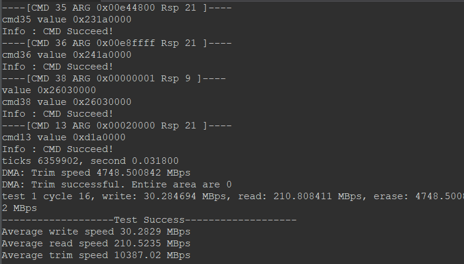

# emmcDemo

This guide explains the available driver functions and user parameters, as well as how to run the eMMC bare-metal application.

- [User Parameter](#user-parameter)
- [Driver Description](#driver-description)
    - [Basic Function](#basic-function)
    - [Test Function](#test-function)

##  User Parameter
The user parameters in the userDef.h file are shown below:

| Name       | Default Value  | Description    |
|--------------|------------------|---------------------|
| EMMC_ADDR    |      SYSTEM_AXI_A_BMB + 0x01200000        |        Starting address of the emmc_host_controller module registers, where the offset address 0x01200000 is configured in the IP (gAXIS_1to5_switch) of the example design project        |
|SYS_REG_ADDR	| SYSTEM_AXI_A_BMB + 0x01300000	| Starting address of the system register module, where the offset address 0x01300000 is configured in the IP (gAXIS_1to5_switch) of the example design project |
|EMMC_INTERRUPT	| SYSTEM_PLIC_USER_INTERRUPT_J_INTERRUPT	| userInterruptJ is chosen as the interrupt for emmc_host_controller in the example design project top.v|
|EMMC_VCCQ	| 1.8	|VCCQ of on board eMMC circuitry |
|EMMC_LARGE_DENSITY|	1	|0: eMMC device capacity <= 2GB1: eMMC device capacity > 2GB|
|EMMC_RCA	|2	| The relative address assigned to the emmc device, the bit width is 16bit, the value of EMMC_RCA should be greater than 1, the value range is 2~65535 |
|EMMC_BLOCK_LEN|	512 |	Block length in bytes, recommended block length is set to 512 bytes |

## Driver Description

In this section, each function is briefly introduced to help you understand how to use it.

### Basic Function
1. efx_emmc_init

        Description: Initialize the eMMC device, after the initialization is completed, the eMMC device enters Transfer State. 
        During the initialization process, the device will go through Idle State / Ready State / Identification State / Stand-by State / Transfer State.

2. efx_emmc_switch_bus_speed_mode

    |Name	| Description |
    |--------------|------------------|
    |mode	| Speed mode  Valid options: hs200/hs400 |
    |bus_width	| Data bus width Valid options: x4/x8 |
    |clk_mhz	 | Output clock to eMMC device in unit MHz Valid options: 200MHz or an even division of 200MHz. |
    |driver_type	|Drive strength type, default is 0x0 |

3. efx_emmc_block_write

    |Name	| Description |
    |--------------|------------------|
    |block_cnt	| Number of write blocks|
    |addr	|Write operation start address, when emmc device capacity > 2GB, the data address is 32bit sector (512 bytes) address; when emmc device capacity <= 2GB, the data address is 32bit byte address|
    |dma_en	|1: Enable ADMA data transfer 0: Enable non-ADMA data transfer|

4. efx_emmc_block_read

    |Name	| Description |
    |--------------|------------------|
    | block_cnt |	Number of read blocks|
    | addr	|Read operation start address, when emmc device capacity > 2GB, the data address is 32bit sector (512 bytes) address; when emmc device capacity <= 2GB, the data address is 32bit byte address|
    | dma_en |	1: Enable ADMA data transfer
    | 0: Enable non-ADMA data transfer|

5.  erase_unit_size_calculate
    
        Description: Calculates the size of the erase unit in bytes corresponding to different erase types (erase or trim). The erase operation (erase or trim) has the erase unit as its smallest unit.

6. efx_emmc_erase

        Description: efx_emmc_erase is generally used for large area erase, such as erasing the entire card or certain partitions.
    
    |Name	| Description |
    |--------------|------------------|
    |start_addr	| Erase operation start address, when emmc device capacity > 2GB, the data address is 32bit sector (512 bytes) address; when emmc device capacity <= 2GB, the data address is 32bit byte address. For erase operations, the minimum erase unit size is erase_unit_size= erase_unit_size_calculate (erase) bytes. The starting address must be on the boundary of the minimum erase unit.|
    |erase_unit_num	|Number of erase units, actual bytes erased = erase_unit_num * erase_unit_size_calculate (erase)|

7. efx_emmc_trim
            
        Description: efx_emmc_trim is generally used for small area erases, such as erasing only a write block.

    |Name	| Description |
    |--------------|------------------|
    | start_addr |Cut operation start address, when emmc device capacity > 2GB, the data address is 32bit sector (512 bytes) address; when emmc device capacity <= 2GB, the data address is 32bit byte address. For cut     operations, the minimum erase unit size is erase_unit_size= erase_unit_size_calculate (trim) bytes. The starting address must be on the boundary of the minimum erase unit.|
    | erase_unit_num	|Number of trim units, actual bytes erased = erase_unit_num * erase_unit_size_calculate (trim)|

8. uda_density_calculate

        Description: Calculates the size of the user data area in bytes.

### Test Function

1.  test_entire_emmc

        Description: The test_entire_emmc function implements a full-space write/read/erase test of the user data area and also calculates the write/read/erase rate.
    
    |Name	| Description |
    |--------------|------------------|
    |dma	|1: Enable DMA mode 0: Enable non-DMA mode |
    |transfer_mode	| Speed mode Valid options: hs200/hs400 |
    |bus_width |	Data bus width Valid options: x4/x8 |
    |clk_freq| Output clock of eMMC device in MHz Valid option: 200MHz or an even division of 200MHz.|
    |len_mode	| 0: Read/write fixed blocks 1: Read/write random blocks |
    |fixed_bk_num |	When len_mode is 0, the number of fixed blocks ranges from 1 to 65535. |
    |erase_mode	| Erase mode Valid options: erase/trim |
    |whole_space_test_num |	Number of full-space tests of user data areas |

2.	 dma_wr_rd_erase
    
            Description: The dma_wr_rd_erase function implements a write/read/erase test on a single area, transferring data using dma mode while calculating the write/read/erase rate.

        |Name	| Description |
        |--------------|------------------|
        | len_mode	    | 0: Read/write fixed blocks 1: Read/write random blocks |
        | fixed_bk_num  | When len_mode is 0, the number of fixed blocks ranges from 1 to 65535. |
        | start_addr	| Starting address, when emmc device capacity > 2GB, data address is 32bit sector (512 bytes) address; when emmc device capacity <= 2GB, data address is 32bit byte address |
        | erase_mode	| Erase mode, both erase and trim |
        | erase_en	    | Erase Enable |
        | test_size_mb	|Test area size in MByte |

3. 	 non_dma_wr_rd

            Description: The non_dma_wr_rd function implements a write/read test for a single region, transferring data using non-dma mode while calculating the write/read rate.  

        |Name	| Description |
        |---------------|------------------|
        |len_mode	    |0: Read/write fixed blocks 1: Read/write random blocks.                                                                                                                    |
        |fixed_bk_num	|When len_mode is 0, the number of fixed blocks ranges from 1 to 65535.                                                                                                    |
        |start_addr     |Starting address, when emmc device capacity > 2GB, data address is 32bit sector (512 bytes) address; when emmc device capacity <= 2GB, data address is 32bit byte address. |
        |test_size_mb   |Test area size in MByte.                                                                                                                                                 |

## Usage
1. In Efinity RISC-V IDE, open the main.c from emmcDemo
2. Clean and run the project by right click emmcDemo_ti.launch. 
3. Go to the serial terminal. User should see the following messages display:

    
    
