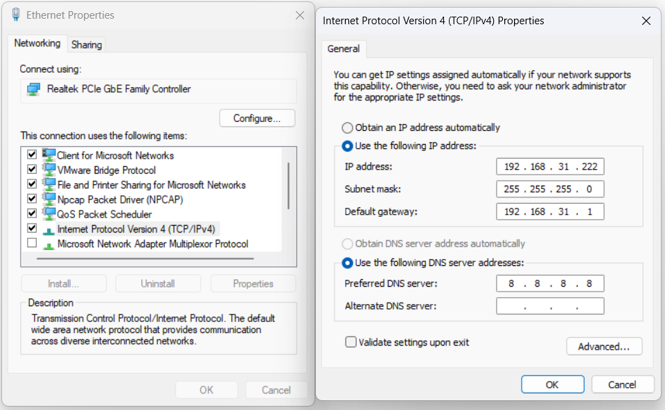
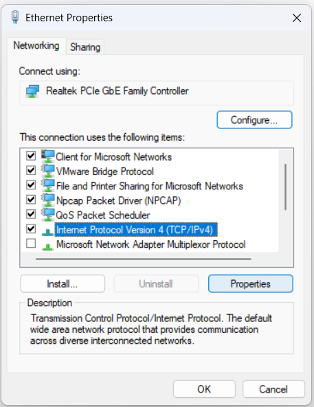
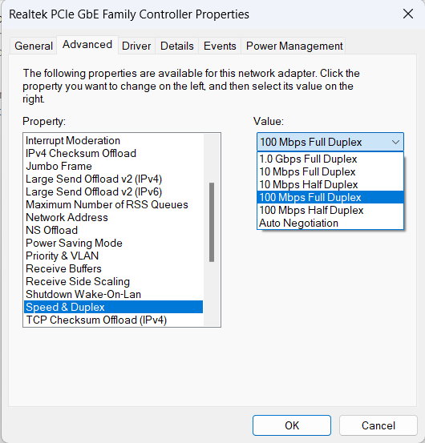
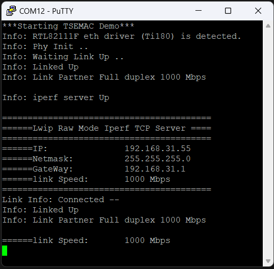
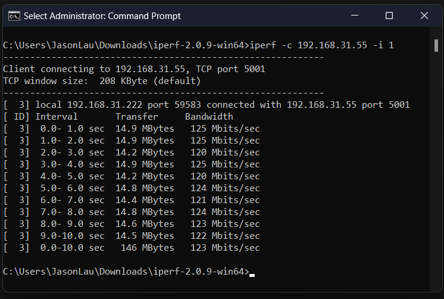

# Ethernet

This guide show on how to run the Ethernet application on baremetal. 

## lwipIperfServer 
lwIP is a small independent implementation of the TCP/IP protocol suite that provides a lightweight TCP/IP stack which is an ideal solution for microcontrollers. The demo also includes lwIP application that allow user to establish an iPerf server to test the overall bandwidth. 

### Preparation

#### Host IP

Make these settings to your computer's Ethernet network adapter as shown above:
1. Set the IP address for your computer to 192.168.31.222.
2. Set the default gateway to 192.168.31.1.
3. Set the Subnet mask to 255.255.255.0.
4. Set the DNS server to 8.8.8.8.
By default, the lwIP has an FPGA IP address of 192.168.31.55, a gateway of 192.168.31.1, and
expects your computer address to be 192.168.31.222. 

#### Changing the speed of Ethernet Adapter
For Ti180J484, it can link up to full duplex 1000Mbps while T120F576 only support up to full duplex 100Mbps. 

 

1. Go to Control Panel > Network and Internet > Network Connection.
2. Right click and select properties on the Ethernet adapter.
3. Click configure at the Internet Protocol Version 4 (TCP/IPv4)
4. Change to Advance Tab and search for "Speed & Duplex" 
5. Change the value either to 100Mbps Full Duplex or 1000Mbps Full Duplex.
6. Else, user can set it to "Auto Negotiation" where it will use 100Mbps for T120F576.

#### Additional Software Needed
- [iperf2](#https://iperf.fr/download/windows/iperf-2.0.9-win64.zip)

### Usage
1. In Efinity RISC-V IDE, open the main.c from lwipIperfServer
2. Clean and run the project by right click lwipIperfServer_xxx.launch where xxx can be as trion or titanium run as lwipIperfServer_xxx. 
3. Go to the serial terminal. User should see the following messages display:

    
    
5. Download [iperf2](#https://iperf.fr/download/windows/iperf-2.0.9-win64.zip) and extract the zip file. 
6. Open a second terminal or command prompt.
7. Change to the directory where it has the iPerf2 executable.
8. Type the command:

    `` .\iperf.exe -c 192.168.31.55 -i 1 ``
    
User should see output similar to the following in the terminal:

  
