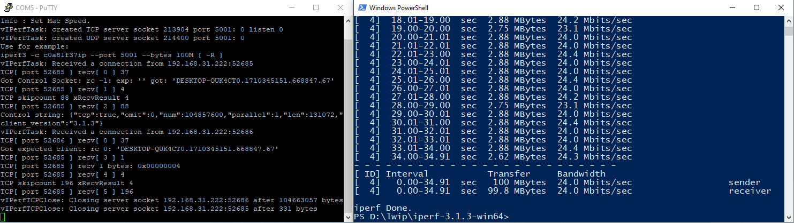
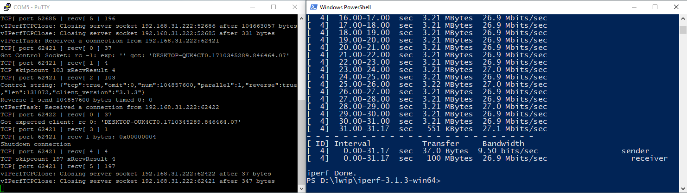
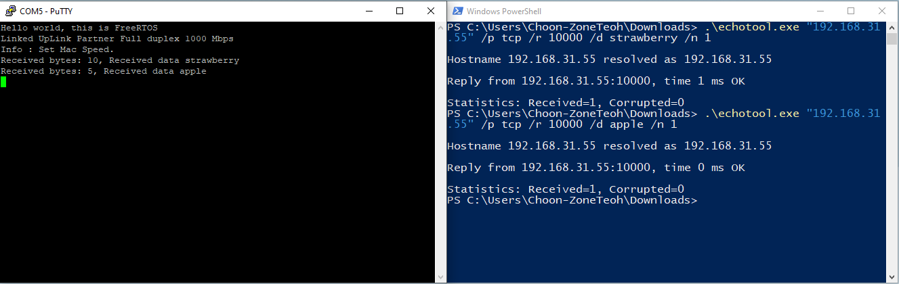
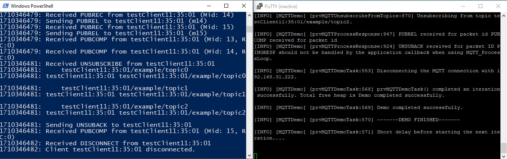
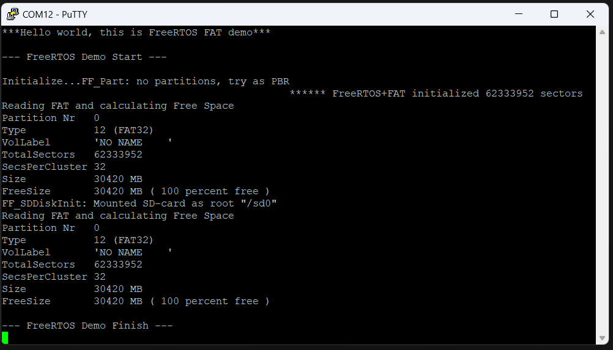

# FreeRTOS

This guide show on how to run the FreeRTOS application on unified hardware. 

Below are the available FreeRTOS demo: 
  - [freertosIperfDemo](ug_freertos.md#freertosiperfdemo)
  - [freertosMqttPlainTextDemo](ug_freertos.md#freertosmqttplaintextdemo)
  - [freertosEchoServerDemo](ug_freertos.md#freertosechoserverdemo)
  - [freertosFatDemo](ug_freertos.md#freertosfatdemo)

## freertosIperfDemo
This example design is to measure the Ethernet TX/RX bandwidth

### Additional Software Needed
- [iPerf3 v3.1.3](https://iperf.fr/download/windows/iperf-3.1.3-win64.zip)

Note that freertosIperfDemo is tested on iperf3 version 3.1.3 only. 

### How to run
#### Measure RX bandwidth (Host to device)

1. Build and run the app
2. Execute iPerf3 with command *.\iperf3.exe -c 192.168.31.55 -p 5001 --bytes 100M*
3. Observe the bandwidth under **sender**\

#### Measure TX bandwidth (Device to host)
1. Build and run the app
2. Execute iPerf3 with command *.\iperf3.exe -c 192.168.31.55 -p 5001 --bytes 100M -R*
3. Observe the bandwidth under **receiver**\

## freertosEchoServerDemo
This demo is to showcase the API usage of FreeRTOS-Plus-TCP. In short, we can use our PC to send a string to the device running freeRTOS through TCP, and it will reply with the same string again.

### Additional Software Needed
- [EchoTool](https://github.com/pbansky/EchoTool/releases/download/v1.5.0.0/echotool.exe)

### How to run
1. Build and run the app
2. Execute EchoTool with command *.\echotool.exe "192.168.31.55" /p tcp /r 10000 /d strawberry /n 1*
3. User should see the received string is printed on serial com and EchoTool reply as following:\

## freertosMqttPlainTextDemo
This demo shows the MQTT protocol in action.

### Additional Software Needed
- [Mosquitto](https://mosquitto.org/download/)

### How to run
1. Edit **C:\Program Files\mosquitto\mosquitto.conf** with the following changes:
    - listener 1883 192.168.31.222
    - allow_anonymous true
2. Execute Mosquitto with command *.\mosquitto.exe -v -c .\mosquitto.conf*
3. Build and run the app
4. User should see a MQTT demo application is running until -------DEMO FINISHED-------\

## freertosFatDemo
### Preparation
- Configure the DS3231 RTC module to the correct time by running the rtcDemo-DS3231

- Format the SD card to FAT32\

### How to run
1. Build and run the app
2. User should see the app is running until string "--- FreeRTOS Demo Finish ---!" is printed.\

3. Remove the SD card and check its content in Windows, User should see a freertos.txt is created with the correct timestamp.\