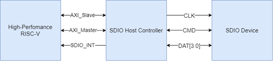
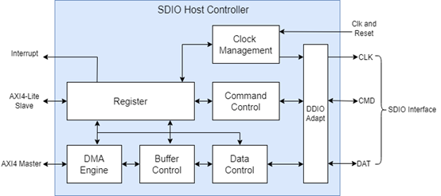
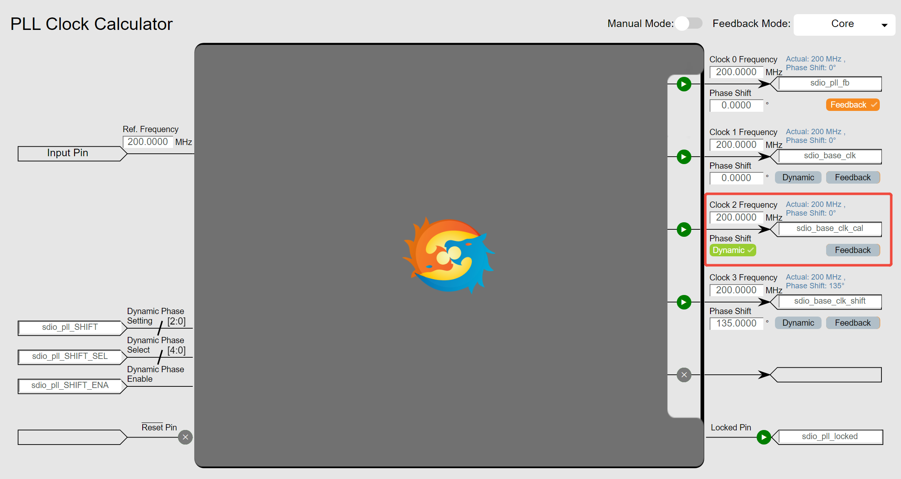
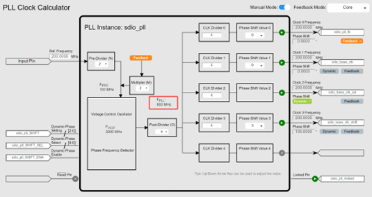
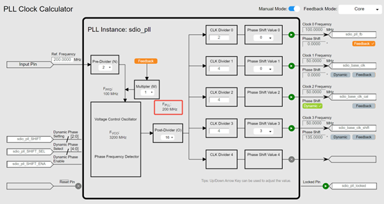
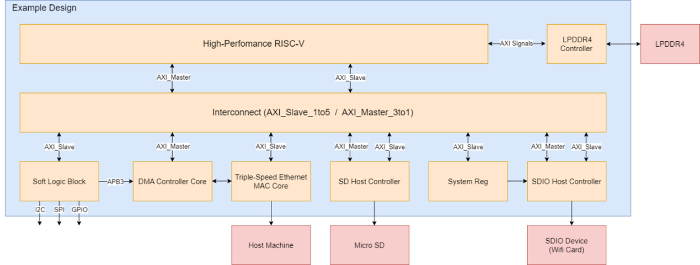

# SDIO Host Controller User Guide

## Contents

- [1 Introduction](#1-introduction)
- [2 Features](#2-features)
- [3 Functional Description](#3-functional-description)
  - [3.1 Initialization](#31-initialization)
  - [3.2 Transfer Modes](#32-transfer-modes)
  - [3.3 ADMA Transfer](#33-adma-transfer)
- [4 Parameter Configuration](#4-parameter-configuration)
  - [4.1 Module Configuration](#41-module-configuration)
    - [4.1.1 SHIFT_SEL](#411-shift_sel)
  - [4.2 PLL Configuration](#42-pll-configuration)
    - [4.2.1 SDR104 Mode](#421-sdr104-mode)
    - [4.2.2 DDR50 / SDR25 Modes](#422-ddr50--sdr25-modes)
- [5 Interface Description](#5-interface-description)
  - [5.1 System Signals](#51-system-signals)
  - [5.2 Phase Shift Control Signals](#52-phase-shift-control-signals)
  - [5.3 AXI4-Lite Interface Signals](#53-axi4-lite-interface-signals)
  - [5.4 AXI4 Interface Signals](#54-axi4-interface-signals)
  - [5.5 SDIO Interface Signals](#55-sdio-interface-signals)
- [6 Register Map](#6-register-map)
  - [6.1 Version (0x000)](#61-version-0x000)
  - [6.2 Base Register 0 (0x004)](#62-base-register-0-0x004)
  - [6.3 Base Status Register 0 (0x008)](#63-base-status-register-0-0x008)
  - [6.4 Base Register 1 (0x00c)](#64-base-register-1-0x00c)
  - [6.5 Argument 2 Register (0x100)](#65-argument-2-register-0x100)
  - [6.6 Block Size Register (0x104)](#66-block-size-register-0x104)
  - [6.7 Argument 1 Register (0x108)](#67-argument-1-register-0x108)
  - [6.8 Transfer Mode Register (0x10c)](#68-transfer-mode-register-0x10c)
  - [6.9 Command Response Register 0 (0x110)](#69-command-response-register-0-0x110)
  - [6.10 Command Response Register 1 (0x114)](#610-command-response-register-1-0x114)
  - [6.11 Command Response Register 2 (0x118)](#611-command-response-register-2-0x118)
  - [6.12 Command Response Register 3 (0x11c)](#612-command-response-register-3-0x11c)
  - [6.13 Buffer Data Port Register (0x120)](#613-buffer-data-port-register-0x120)
  - [6.14 Present State Register (0x124)](#614-present-state-register-0x124)
  - [6.15 Host Control Register (0x128)](#615-host-control-register-0x128)
  - [6.16 Interrupt Status Register (0x130)](#616-interrupt-status-register-0x130)
  - [6.17 Interrupt Status Enable Register (0x134)](#617-interrupt-status-enable-register-0x134)
  - [6.18 Interrupt Signal Enable Register (0x138)](#618-interrupt-signal-enable-register-0x138)
  - [6.19 Host Capabilities Register 0 (0x140)](#619-host-capabilities-register-0-0x140)
  - [6.20 Host Adjustment Register (0x144)](#620-host-adjustment-register-0x144)
  - [6.21 ADMA System Address Register (0x158)](#621-adma-system-address-register-0x158)
  - [6.22 ADMA System Address Register (0x15c)](#622-adma-system-address-register-0x15c)
- [7 Example Design Description](#7-example-design-description)
  - [7.1 System Overview](#71-system-overview)
- [8 System Registers (System Reg)](#8-system-registers-system-reg)
  - [8.1 Date Register (0x000)](#81-date-register-0x000)
  - [8.2 Test Register (0x004)](#82-test-register-0x004)
  - [8.3 Reset Register (0x008)](#83-reset-register-0x008)

## 1 Introduction

The SDIO Host Controller is a core module in embedded systems used to connect and manage SDIO devices. The SDIO (Secure Digital Input Output) standard extends the SD memory card protocol to support I/O functions, enabling devices to implement extended features such as wireless communication through the SD interface.

Figure 1: SDIO Host Controller Application Diagram

## 2 Features

- Supports the following SDIO 3.0 speed specifications:

| Mode Name | Data Rate | Bus Width | Frequency               |
| --------- | --------- | --------- | ----------------------- |
| SDR104    | Single    | 4         | 0~200MHz (1) |
| DDR50     | Dual      | 4         | 0~50MHz(2)   |
| SDR25     | Single    | 4         | 0~50MHz(2)   |

Table 1: Speed Specifications

- Supports ADMA and NON-DMA(3) data transfers
- Supports a maximum block length of 2 Kbytes
- Supports configurable data buffer size
- Supports SDIO interrupts, command interrupts, and data interrupts
- Supports CRC check for commands and data
- AXI4-Lite interface is used for register configuration and NON-DMA data transfer, while AXI4 interface is used for ADMA data transfer

**Important Notes:**

**Note 1:** SDR104 mode supports 200 MHz and 200 MHz even-divider frequencies

**Note 2:** DDR50 / SDR25 modes support 50 MHz and 50 MHz even-divider frequencies

**Note 3:** NON-DMA refers to data transfers performed via register read/write

## 3 Functional Description

The functional block diagram of the SDIO Host Controller is shown below.

Figure 2: Functional Block Diagram of the SDIO Host Controller

- **Clock Management:** Generates clocks for the SDIO device.
- **Command Control:** Sends command (CMD) instructions and receives responses from the SDIO device.
- **Data Control:** Sends data from the RISC-V processor and receives data from the SDIO device.
- **Buffer Control:** Buffers data sent by the RISC-V processor and responses from the SDIO device.
- **DMA Engine:** Implements the ADMA data transfer protocol.
- **Register:** Contains the control registers of the SDIO Host Controller and the response registers of the SDIO device.
- **DDIO Adapt:** Converts single-edge signals to double-edge signals and vice versa.

### 3.1 Initialization

During initialization, the SDIO Host Controller selects the SDIO device and reads the CCCR (Card Common Control Registers). It then configures the operating voltage, bus width, and speed mode. If the SDR104 or SDR50 mode is selected, the host controller sends the Tuning command (CMD19) to adjust the sampling clock phase, ensuring correct data sampling.

### 3.2 Transfer Modes

The SDIO Host Controller supports both block mode and byte mode. In block mode, the maximum block length is 2048 bytes. A single CMD53 command (IO_RW_EXTENDED Command) can transfer 1 to 511 blocks of data; unlimited block mode is not supported. In byte mode, a single CMD53 command can transfer 1 to 512 bytes of data.

### 3.3 ADMA Transfer

The SDIO Host Controller supports advanced direct memory access (ADMA) data transfers, which are typically used for moving large amounts of data. First, a descriptor table must be created in system memory, with each descriptor capable of transferring up to 65,536 bytes. If more data needs to be transferred, multiple descriptors must be created. Once the descriptor list is prepared, ADMA is started, and the SDIO Host Controller automatically fetches the descriptors from system memory to begin data transfer. The last descriptor must include a stop bit to indicate that it is the final data transfer. When the last descriptor is executed and the data transfer is complete, ADMA generates an interrupt to the CPU.

## 4 Parameter Configuration
### 4.1 Module Configuration

| Parameter Name     | Value         | Description                                                                                       |
| ------------------ | ------------- | ------------------------------------------------------------------------------------------------- |
| ADMA_DATA_WIDTH    | 128           | Data width of the AXI4 Master interface                                                           |
| BASE_CLK_FREQ      | 200/100/50/25 | Clock frequency of the sdio_base_clk interface signal, in MHz                                     |
| IO_VOLTAGE         | 0 / 1         | Voltage level for CMD and DATA lines; 0: 1.8V, 1: 3.3V                                            |
| SHIFT_SEL          | 5'h4          | Related to the output position of sdio_base_clk_cal in the PLL                                    |
| BUFFER_BLOCK_SIZE  | 2048          | Maximum block length, in bytes                                                                    |
| BUFFER_BLOCK_COUNT | 4             | Number of blocks the FIFO buffer can hold; FIFO capacity = BUFFER_BLOCK_COUNT × BUFFER_BLOCK_SIZE |

Table 2: User-Configurable Module Parameters

#### 4.1.1 SHIFT_SEL

As shown in the figure below, if the output clock **Clock N** is set to **Dynamic Phase Shift**, the corresponding bit **N** of the input SHIFT_SEL\[4:0\] should be set to 1.

In the Example Design project **sdio_pll**, the clock output corresponding to sdio_base_clk_cal is **Clock2** and is configured for Dynamic Phase Shift. Therefore, the value of SHIFT_SEL\[4:0\] is 5'b00100 (i.e., 5'h4).

If the clock output corresponding to sdio_base_clk_cal changes, the value of SHIFT_SEL\[4:0\] should be updated accordingly.

Figure 3. SHIFT_SEL

### 4.2 PLL Configuration

The PLL configuration for high-speed modes is backward compatible with lower-speed modes. For example, if the PLL is configured for SDR104 mode, the same configuration also supports modes with data rates lower than SDR104.

#### 4.2.1 SDR104 Mode

When the speed mode is set to **SDR104**, the following requirements apply:

- The frequencies of sdio_base_clk, sdio_base_clk_cal, and sdio_base_clk_shift are 200 MHz.
- The initial phase of sdio_base_clk_shift is 135°, which serves as the output clock for the sdio_clk pin.
- sdio_base_clk_cal is configured to support dynamic phase adjustment. According to **Base Register 1 (0x00C) bits \[8:6\]**, each increment of the sdio_pll_SHIFT value delays sdio_base_clk_cal by 45°. In practice, each increment of sdio_pll_SHIFT introduces a delay of 0.5 Fpll cycles to sdio_base_clk_cal.

Calculating the Fpll frequency:

T_Fpll = T_sdio_base_clk_cal / 4 = 5 ns / 4 = 1.25 ns  
F_Fpll = 1 / T_Fpll = 1 / 1.25 ns = 800 MHz

If **Auto Mode** is used for configuration, Fpll may not be exactly 800 MHz. In this case, the **Manual Mode** switch should be enabled to configure the parameters manually. Refer to the figure below for example settings.

Figure 4. SDIO PLL Configuration Reference (sdio_base_clk = 200 MHz)

#### 4.2.2 DDR50 / SDR25 Modes

When the speed mode is set to DDR50 or SDR25, the following requirements apply:

- The frequencies of **sdio_base_clk**, **sdio_base_clk_cal**, and **sdio_base_clk_shift** are 50 MHz.
- The initial phase of **sdio_base_clk_shift** is 135°, which is used as the output clock for the SDIO_CLK pin.
- **sdio_base_clk_cal** should be configured to support dynamic phase adjustment.  
   Given that  
   **TFpll = Tsdio_base_clk_cal / 4 = 20 ns / 4 = 5 ns**,  
   the frequency of **Fpll** is 200 MHz.

Enable **Manual Mode** and refer to the figure below to manually configure the parameters.

Figure 5. SDIO PLL Configuration Reference (sdio_base_clk = 50 MHz)

## 5 Interface Description
### 5.1 System Signals

| **Signal Name**   | **Direction** | **Description**                                                     |
| ----------------- | ------------- | ------------------------------------------------------------------- |
| sdio_rst          | input         | Global reset signal, active high                                    |
| sdio_base_clk     | input         | Base clock signal                                                   |
| sdio_base_clk_cal | input         | Same frequency as the base clock, with dynamically adjustable phase |
| s_axi_aclk        | input         | AXI4-Lite interface clock signal                                    |
| m_axi_clk         | input         | AXI4 interface clock signal                                         |
| sdio_int          | output        | Interrupt signal                                                    |

### 5.2 Phase Shift Control Signals

| **Signal Name**      | **Direction** | **Description**                                                                     |
| -------------------- | ------------- | ----------------------------------------------------------------------------------- |
| pll_SHIFT\[2:0\]     | output        | Output to the PLL hard IP for dynamic phase shifting of the sdio_base_clk_cal clock |
| pll_SHIFT_SEL\[4:0\] | output        |                                                                                     |
| pll_SHIFT_ENA        | output        |                                                                                     |

### 5.3 AXI4-Lite Interface Signals

| **Signal Name**     | **Direction** | **Description**                       |
| ------------------- | ------------- | ------------------------------------- |
| s_axi_awaddr\[9:0\] | input         | AXI4-Lite write address               |
| s_axi_awvalid       | input         | AXI4-Lite write address valid signal  |
| s_axi_awready       | output        | AXI4-Lite write address ready signal  |
| s_axi_wdata\[31:0\] | input         | AXI4-Lite write data                  |
| s_axi_wstrb\[3:0\]  | input         | AXI4-Lite write data byte strobe      |
| s_axi_wvalid        | input         | AXI4-Lite write data valid signal     |
| s_axi_wready        | output        | AXI4-Lite write ready signal          |
| s_axi_bresp\[1:0\]  | output        | AXI4-Lite write response              |
| s_axi_bvalid        | output        | AXI4-Lite write response valid signal |
| s_axi_bready        | input         | AXI4-Lite write response ready signal |
| s_axi_araddr\[9:0\] | input         | AXI4-Lite read address                |
| s_axi_arvalid       | input         | AXI4-Lite read address valid signal   |
| s_axi_arready       | output        | AXI4-Lite read address ready signal   |
| s_axi_rresp\[1:0\]  | output        | AXI4-Lite read response               |
| s_axi_rdata\[31:0\] | output        | AXI4-Lite read data                   |
| s_axi_rvalid        | output        | AXI4-Lite read data valid signal      |
| s_axi_rready        | input         | AXI4-Lite read ready signal           |

### 5.4 AXI4 Interface Signals

| **Signal Name**                              | **Direction** | **Description**                                             |
| -------------------------------------------- | ------------- | ----------------------------------------------------------- |
| m_axi_awvalid                                | output        | AXI4 write address valid signal                             |
| m_axi_awaddr\[31:0\]                         | output        | AXI4 write address                                          |
| m_axi_awlen\[7:0\]                           | output        | AXI4 burst length for write transactions                    |
| m_axi_awsize\[2:0\]                          | output        | AXI4 write burst size (bytes per beat)                      |
| m_axi_awburst\[1:0\]                         | output        | AXI4 burst type for write transactions                      |
| m_axi_awprot\[2:0\]                          | output        | AXI4 protection type for write transactions                 |
| m_axi_awlock\[1:0\]                          | output        | AXI4 lock type for write transactions                       |
| m_axi_awcache\[3:0\]                         | output        | AXI4 cache type for write transactions                      |
| m_axi_awready                                | input         | AXI4 write address ready signal                             |
| m_axi_wdata  \[ADMA_DATA_WIDTH-1:0\]   | output        | AXI4 write data                                             |
| m_axi_wstrb  \[ADMA_DATA_WIDTH/8-1:0\] | output        | AXI4 write strobe (byte enable)                             |
| m_axi_wlast                                  | output        | AXI4 write last signal, indicates the final data in a burst |
| m_axi_wvalid                                 | output        | AXI4 write data valid signal                                |
| m_axi_wready                                 | input         | AXI4 write ready signal                                     |
| m_axi_bresp\[1:0\]                           | input         | AXI4 write response                                         |
| m_axi_bvalid                                 | input         | AXI4 write response valid signal                            |
| m_axi_bready                                 | output        | AXI4 write response ready signal                            |
| m_axi_arvalid                                | output        | AXI4 read address valid signal                              |
| m_axi_araddr\[31:0\]                         | output        | AXI4 read address                                           |
| m_axi_arlen \[7:0\]                          | output        | AXI4 burst length for read transactions                     |
| m_axi_arsize \[2:0\]                         | output        | AXI4 read burst size (bytes per beat)                       |
| m_axi_arburst\[1:0\]                         | output        | AXI4 burst type for read transactions                       |
| m_axi_arprot\[2:0\]                          | output        | AXI4 protection type for read transactions                  |
| m_axi_arlock\[1:0\]                          | output        | AXI4 lock type for read transactions                        |
| m_axi_arcache\[3:0\]                         | output        | AXI4 cache type for read transactions                       |
| m_axi_arready                                | input         | AXI4 read address ready signal                              |
| m_axi_rvalid                                 | input         | AXI4 read data valid signal                                 |
| m_axi_rdata  \[ADMA_DATA_WIDTH-1:0\]   | input         | AXI4 read data                                              |
| m_axi_rlast                                  | input         | AXI4 read last signal, indicates the final data in a burst  |
| m_axi_rresp \[1:0\]                          | input         | AXI4 read response                                          |
| m_axi_rready                                 | output        | AXI4 read ready signal                                      |

### 5.5 SDIO Interface Signals

| **Signal Name**        | **Direction** | **Description**                 |
| ---------------------- | ------------- | ------------------------------- |
| sdio_clk_HI            | output        | SDIO clock signal               |
| sdio_clk_LO            | output        |
| sdio_cmd_IN_HI         | input         | SDIO CMD input signal           |
| sdio_cmd_IN_LO         | input         |
| sdio_cmd_OUT_HI        | output        | SDIO CMD output signal          |
| sdio_cmd_OUT_LO        | output        |
| sdio_cmd_OE            | output        | SDIO CMD output enable signal   |
| sdio_dat_IN_HI \[3:0\] | input         | SDIO data input signals         |
| sdio_dat_IN_LO \[3:0\] | input         |
| sdio_dat_OUT_HI\[3:0\] | output        | SDIO data output signals        |
| sdio_dat_OUT_LO\[3:0\] | output        |
| sdio_dat_OE\[3:0\]     | output        | SDIO data output enable signals |

## 6 Register Map

| **Attribute** | **Description** |
| ------------- | --------------- |
| R/W           | Read/Write      |
| RC            | Read Clear      |
| RO            | Read Only       |

Table 3: Register Access Attributes

### 6.1 Version (0x000)

| **Bits** | **Reset Value** | **Description**  | **Access** |
| -------- | --------------- | ---------------- | ---------- |
| 31-0     | \-              | Version register | RO         |

### 6.2 Base Register 0 (0x004)

| **Bits** | **Reset Value** | **Description**                                      | **Access** |
| -------- | --------------- | ---------------------------------------------------- | ---------- |
| 31-17    | \-              | Reserved                                             | \-         |
| 16       | 1'b0            | Clock enable                                         | R/W        |
| 15-0     | 16'h0           | Clock divider (clk_div), must be 1 or an even number | R/W        |

### 6.3 Base Status Register 0 (0x008)

| **Bits** | **Reset Value** | **Description**                                         | **Access** |
| -------- | --------------- | ------------------------------------------------------- | ---------- |
| 31:2     | \-              | Reserved                                                | \-         |
| 1        | 1'b0            | Data line busy status:  0: Idle  1: Busy    | RO         |
| 0        | 1'b0            | Command line busy status:  0: Idle  1: Busy | RO         |

### 6.4 Base Register 1 (0x00C)

| **Bits** | **Reset Value** | **Description**                                                                                                                                                              | **Access** |
| -------- | --------------- | ---------------------------------------------------------------------------------------------------------------------------------------------------------------------------- | ---------- |
| 31:16    | 16'h0           | Sampling point counter value, **sample_cnt < clk_div**                                                                                                                       | R/W        |
| 15:9     | \-              | Reserved                                                                                                                                                                     | \-         |
| 8:6      | 3'h0            | Phase shift value issued by CPU:  000b: 0°  001b: 45°  010b: 90°  011b: 135°  100b: 180°  101b: 225°  110b: 270°  111b: 315° | R/W        |
| 5:1      | \-              | Reserved                                                                                                                                                                     | \-         |
| 0        | 1'b0            | Phase shift trigger pulse issued by CPU                                                                                                                                      | R/W        |

### 6.5 Argument 2 Register (0x100)

| **Bits** | **Reset Value** | **Description**                                       | **Access** |
| -------- | --------------- | ----------------------------------------------------- | ---------- |
| 31:0     | 32'h0           | Physical system memory address used for ADMA transfer | R/W        |

### 6.6 Block Size Register (0x104)

| **Bits** | **Reset Value** | **Description**                                                                                                                                                                                                                                                                                                                                                                                                                                            | **Access** |
| -------- | --------------- | ---------------------------------------------------------------------------------------------------------------------------------------------------------------------------------------------------------------------------------------------------------------------------------------------------------------------------------------------------------------------------------------------------------------------------------------------------------- | ---------- |
| 31:16    | 16'h0           | Block count for the current transfer.  The host driver programs this field with a value between 1 and the maximum number of blocks.  0000h: Stop count  0001h: 1 block  0002h: 2 blocks  ...  FFFFh： 65535 blocks                                                                                                                                                                                                     | R/W        |
| 15       | \-              | Reserved                                                                                                                                                                                                                                                                                                                                                                                                                                                   | \-         |
| 14:12    | 3'h0            | Host ADMA buffer boundary.  Specifies the size of contiguous buffers in system memory.  The ADMA transfer pauses at each boundary specified by this field, and the host controller generates an ADMA interrupt to request the host driver to update the ADMA system address register.  000b: 4 KB  001b: 8 KB  010b: 16 KB  011b: 32 KB  100b: 64 KB  101b: 128 KB  110b: 256 KB  111b: 512 KB | R/W        |
| 11:0     | 12'h0           | Transfer block size.  Specifies the data block size for CMD53 transfers.  The programmable range is from 1 to 2048 bytes.  000h: No data transfer  001h: 1 byte  002h: 2 bytes  ...  800h: 2048 bytes                                                                                                                                                                                                            | R/W        |

### 6.7 Argument 1 Register (0x108)

| **Bits** | **Reset Value** | **Description**                                                                                         | **Access** |
| -------- | --------------- | ------------------------------------------------------------------------------------------------------- | ---------- |
| 31:0     | 32'h0           | Command Argument 1.  The SDIO command argument corresponds to bits \[39:8\] of the command frame. | R/W        |

### 6.8 Transfer Mode Register (0x10C)

| **Bits** | **Reset Value** | **Description**                                                                                                                                                       | **Access** |
| -------- | --------------- | --------------------------------------------------------------------------------------------------------------------------------------------------------------------- | ---------- |
| 31:30    | \-              | Reserved                                                                                                                                                              | \-         |
| 29:24    | 6'h0            | Command index.  Set to the command number (CMD0-63, ACMD0-63).                                                                                                  | R/W        |
| 23:22    | \-              | Reserved                                                                                                                                                              | \-         |
| 21       | 1'b0            | Data present select.  Set to 1 to indicate data is present and will be transferred via DAT lines.  1: Data present  0: No data                      | R/W        |
| 20       | 1'b0            | Command index check enable.  When set to 1, the host controller checks whether the index field in the response matches the command index.                       | R/W        |
| 19       | 1'b0            | Command CRC check enable.  When set to 1, the host controller checks the CRC field in the response. If an error is detected, a "Command CRC Error" is reported. | R/W        |
| 18       | \-              | Reserved                                                                                                                                                              | \-         |
| 17:16    | 2'h0            | Response type select.  00b: No response  01b: 136-bit response  10b: 48-bit response  11b: 48-bit response with busy check                    | R/W        |
| 15:6     | \-              | Reserved                                                                                                                                                              | \-         |
| 5        | 1'b0            | Block count enable / single or multiple block select.  0: Single block  1: Multiple block                                                                 | R/W        |
| 4        | 1'b0            | Data transfer direction select.  Defines the data transfer direction on DAT lines.  0: Write (host to card)  1: Read (card to host)                 | R/W        |
| 3:2      | 2'h0            | Auto command enable.  00b: Disable auto command  01b: Enable Auto I/O Abort  10b/11b: Reserved                                                      | R/W        |
| 1        | 1'b0            | Block count enable.  Enables the block count register for multiple block transfers.  0: Disable  1: Enable                                          | R/W        |
| 0        | 1'b0            | DMA enable.  Enables DMA operation.  0: No data transfer or non-DMA transfer  1: DMA transfer                                                       | R/W        |

### 6.9 Command Response Register 0 (0x110)

| **Bits** | **Reset Value** | **Description**           | **Access** |
| -------- | --------------- | ------------------------- | ---------- |
| 31:0     | 32'h0           | Command response \[31:0\] | RC         |

### 6.10 Command Response Register 1 (0x114)

| **Bits** | **Reset Value** | **Description**            | **Access** |
| -------- | --------------- | -------------------------- | ---------- |
| 31:0     | 32'h0           | Command response \[63:32\] | RC         |

### 6.11 Command Response Register 2 (0x118)

| **Bits** | **Reset Value** | **Description**            | **Access** |
| -------- | --------------- | -------------------------- | ---------- |
| 31:0     | 32'h0           | Command response \[95:64\] | RC         |

### 6.12 Command Response Register 3 (0x11C)

| **Bits** | **Reset Value** | **Description**             | **Access** |
| -------- | --------------- | --------------------------- | ---------- |
| 31:24    | \-              | Reserved                    | \-         |
| 23:0     | 24'h0           | Command response \[119:96\] | RC         |

### 6.13 Buffer Data Port Register (0x120)

| **Bits** | **Reset Value** | **Description**                                              | **Access** |
| -------- | --------------- | ------------------------------------------------------------ | ---------- |
| 31:0     | 32'h0           | 32-bit data port register used to access the internal buffer | R/W        |

### 6.14 Present State Register (0x124)

| **Bits** | **Reset Value** | **Description**                                                                                                                                                                                        | **Access** |
| -------- | --------------- | ------------------------------------------------------------------------------------------------------------------------------------------------------------------------------------------------------ | ---------- |
| 31:24    | \-              | Reserved                                                                                                                                                                                               | \-         |
| 23:20    | 4'hF            | DAT\[3:0\] line signal level                                                                                                                                                                           | RO         |
| 19:12    | \-              | Reserved                                                                                                                                                                                               | \-         |
| 11       | 1'b0            | Buffer read enable (for non-DMA read transfers).  0: Read disabled  1: Read enabled                                                                                                        | RO         |
| 10       | 1'b0            | Buffer write enable (for non-DMA write transfers).  0: Write disabled  1: Write enabled                                                                                                    | RO         |
| 9        | 1'b0            | Read transfer active.  Indicates whether a read transfer is in progress.  0: No valid data  1: Data transfer in progress                                                             | RO         |
| 8        | 1'b0            | Write transfer active.  Indicates whether a write transfer is in progress.  0: No valid data  1: Data transfer in progress                                                           | RO         |
| 7:4      | \-              | Reserved                                                                                                                                                                                               | \-         |
| 3        | 1'b0            | Re-tuning request (not supported)                                                                                                                                                                      | R/W        |
| 2        | 1'b0            | DAT line active.  Indicates whether any DAT line on the SDIO bus is in use.  0: DAT lines inactive  1: DAT line active                                                               | RO         |
| 1        | 1'b0            | Command inhibit (DAT).  Indicates whether the DAT line is active or a read transfer is active.  0: Commands using DAT lines can be issued  1: Commands using DAT lines are inhibited | RO         |
| 0        | 1'b0            | Command inhibit (CMD).  Indicates whether the CMD line is available.  0: Commands can be issued on the CMD line  1: Command issue is inhibited                                       | RO         |

### 6.15 Host Control Register (0x128)

| **Bits**   | **Reset Value** | **Description**                                                                                                                                          | **Access** |
|------------|-----------------|----------------------------------------------------------------------------------------------------------------------------------------------------------|------------|
| 31:20      | \-              | Reserved                                                                                                                                                 | \-         |
| 19         | 1'b0            | Block gap interrupt enable. Enabling interrupt detection at block gaps during multi-block data transfer. 0: Disable 1: Enable                      | R/W        |
| 18         | 1'b0            | Read wait control. If the card supports read wait, this bit enables the read wait protocol using the DAT\[2\] line to pause data transfer. 0: Disable 1: Enable | R/W        |
| 17         | 1'b0            | Continue request. Restarts a transfer that was stopped by a Stop At Block Gap request. 0: No restart 1: Restart                                      | R/W        |
| 16         | 1'b0            | Stop at block gap request. Stops read/write transactions at the next block gap for non-DMA and ADMA transfers. 0: Continue transfer 1: Stop         | R/W        |
| 15:4       | \-              | Reserved                                                                                                                                                 | \-         |
| 3          | 1'b0            | Data sampling mode. 0: SDR mode 1: DDR mode                                                                                                        | R/W        |
| 2          | \-              | Reserved                                                                                                                                                 | \-         |
| 1          | 1'b0            | Data transfer width. Selects the data bus width of the host controller. 0: x1 1: x4                                                              | R/W        |
| 0          | 1'b0            | LED control (not used). Intended to indicate card access status. 0: LED off 1: LED on                                                           | R/W        |

### 6.16 Interrupt Status Register (0x130)

| **Bits**   | **Reset Value** | **Description**                                                                                                                                       | **Access** |
|------------|-----------------|-------------------------------------------------------------------------------------------------------------------------------------------------------|------------|
| 31:22      | \-              | Reserved                                                                                                                                              | \-         |
| 21         | 1'b0            | Data CRC error interrupt. 0: No interrupt 1: Interrupt occurred                                                                                 | RO         |
| 20         | \-              | Reserved                                                                                                                                              | \-         |
| 19         | 1'b0            | Command index error interrupt. 0: No interrupt 1: Interrupt occurred                                                                            | RO         |
| 18         | 1'b0            | Command end bit error interrupt. 0: No interrupt 1: Interrupt occurred                                                                          | RO         |
| 17         | 1'b0            | Command CRC error interrupt. 0: No interrupt 1: Interrupt occurred                                                                              | RO         |
| 16         | 1'b0            | Command timeout error interrupt. 0: No interrupt 1: Interrupt occurred                                                                          | RO         |
| 15:9       | \-              | Reserved                                                                                                                                              | \-         |
| 8          | 1'b0            | Card interrupt. 0: No interrupt 1: Interrupt occurred                                                                                           | RO         |
| 7          | 1'b0            | Card removal. 0: No interrupt 1: Interrupt occurred                                                                                              | RO         |
| 6          | 1'b0            | Card insertion. 0: No interrupt 1: Interrupt occurred                                                                                           | RO         |
| 5          | 1'b0            | Buffer read ready. 0: No interrupt 1: Interrupt occurred                                                                                        | RO         |
| 4          | 1'b0            | Buffer write ready. 0: No interrupt 1: Interrupt occurred                                                                                       | RO         |
| 3          | 1'b0            | Reserved                                                                                                                                              | \-         |
| 2          | 1'b0            | Block gap event. 0: No interrupt 1: Interrupt occurred                                                                                           | RO         |
| 1          | 1'b0            | Transfer complete. 0: No interrupt 1: Interrupt occurred                                                                                        | RO         |
| 0          | 1'b0            | Command complete. 0: No interrupt 1: Interrupt occurred                                                                                         | RO         |

### 6.17 Interrupt Status Enable Register (0x134)

| **Bits**   | **Reset Value** | **Description**                                                                                                                                     | **Access** |
|------------|-----------------|-----------------------------------------------------------------------------------------------------------------------------------------------------|------------|
| 31:22      | \-              | Reserved                                                                                                                                           | \-         |
| 21         | 1'b0            | Data CRC error interrupt enable. 0: Disable 1: Enable                                                                                        | R/W        |
| 20         | \-              | Reserved                                                                                                                                           | \-         |
| 19         | 1'b0            | Command index error interrupt enable. 0: Disable 1: Enable                                                                                  | R/W        |
| 18         | 1'b0            | Command end bit error interrupt enable. 0: Disable 1: Enable                                                                                | R/W        |
| 17         | 1'b0            | Command CRC error interrupt enable. 0: Disable 1: Enable                                                                                   | R/W        |
| 16         | 1'b0            | Command timeout error interrupt enable. 0: Disable 1: Enable                                                                               | R/W        |
| 15:9       | \-              | Reserved                                                                                                                                           | \-         |
| 8          | 1'b0            | Card interrupt enable. 0: Disable 1: Enable                                                                                                 | R/W        |
| 7          | 1'b0            | Card removal interrupt enable. 0: Disable 1: Enable                                                                                        | R/W        |
| 6          | 1'b0            | Card insertion interrupt enable. 0: Disable 1: Enable                                                                                      | R/W        |
| 5          | 1'b0            | Buffer read ready interrupt enable. 0: Disable 1: Enable                                                                                   | R/W        |
| 4          | 1'b0            | Buffer write ready interrupt enable. 0: Disable 1: Enable                                                                                  | R/W        |
| 3          | \-              | Reserved                                                                                                                                           | \-         |
| 2          | 1'b0            | Block gap event interrupt enable. 0: Disable 1: Enable                                                                                     | R/W        |
| 1          | 1'b0            | Transfer complete interrupt enable. 0: Disable 1: Enable                                                                                   | R/W        |
| 0          | 1'b0            | Command complete interrupt enable. 0: Disable 1: Enable                                                                                    | R/W        |

### 6.18 Interrupt Signal Enable Register (0x138)

| **Bits** | **Reset Value** | **Description**                                                         | **Access** |
| -------- | --------------- | ----------------------------------------------------------------------- | ---------- |
| 31:22    | \-              | Reserved                                                                | \-         |
| 21       | 1'b0            | Data CRC error signal enable.  0: Masked  1: Enabled        | R/W        |
| 20       | \-              | Reserved                                                                | \-         |
| 19       | 1'b0            | Command index error signal enable.  0: Masked  1: Enabled   | R/W        |
| 18       | 1'b0            | Command end bit error signal enable.  0: Masked  1: Enabled | R/W        |
| 17       | 1'b0            | Command CRC error signal enable.  0: Masked  1: Enabled     | R/W        |
| 16       | 1'b0            | Command timeout error signal enable.  0: Masked  1: Enabled | R/W        |
| 15:9     | \-              | Reserved                                                                | \-         |
| 8        | 1'b0            | Card interrupt signal enable.  0: Masked  1: Enabled        | R/W        |
| 7        | 1'b0            | Card removal signal enable.  0: Masked  1: Enabled          | R/W        |
| 6        | 1'b0            | Card insertion signal enable.  0: Masked  1: Enabled        | R/W        |
| 5        | 1'b0            | Buffer read ready signal enable.  0: Masked  1: Enabled     | R/W        |
| 4        | 1'b0            | Buffer write ready signal enable.  0: Masked  1: Enabled    | R/W        |
| 3        | \-              | Reserved                                                                | \-         |
| 2        | 1'b0            | Block gap event signal enable.  0: Masked  1: Enabled       | R/W        |
| 1        | 1'b0            | Transfer complete signal enable.  0: Masked  1: Enabled     | R/W        |
| 0        | 1'b0            | Command complete signal enable.  0: Masked  1: Enabled      | R/W        |

### 6.19 Host Capabilities Register 0 (0x140)

| **Bits** | **Reset Value** | **Description**                                                                                                                              | **Access** |
| -------- | --------------- | -------------------------------------------------------------------------------------------------------------------------------------------- | ---------- |
| 31:16    | \-              | Maximum block size (in bytes).  Indicates the maximum block length that the host controller buffer supports for read/write operations. | RO         |
| 15:12    | \-              | I/O voltage for command and data lines.  0: 1.8V  1: 3.3V                                                                        | RO         |
| 11:10    | \-              | Reserved                                                                                                                                     | \-         |
| 9:0      | \-              | Frequency of the Module clock (sdio_base_clk), in MHz                                                                                        | RO         |

### 6.20 Host Adjustment Register (0x144)

| **Bits** | **Reset Value** | **Description**                                                                                                                                       | **Access** |
|----------|-----------------|-------------------------------------------------------------------------------------------------------------------------------------------------------|------------|
| 31:10    | -               | Reserved                                                                                                                                             | -          |
| 9        | -               | SDIO data consistency check between samples captured on the rising and falling edges of the SDIO clock. 1: Mismatch 0: Match                   | RO         |
| 8        | -               | SDIO CMD consistency check between samples captured on the rising and falling edges of the SDIO clock. 1: Mismatch 0: Match                     | RO         |
| 7:0      | 8'h6            | Read_Pause_Delay. Used to adjust the timing of stopping the clock at a block gap. When clk_div = 1: N = Read_Pause_Delay − 2 When clk_div = 2: N = Read_Pause_Delay − 6 When clk_div = 4 or 6: N = Read_Pause_Delay − 9 When clk_div ≥ 8: N = Read_Pause_Delay − 10 Where N represents the number of clock cycles after the block gap at which the clock is stopped to pause the read operation (default N = 4). clk_div is the clock division factor. | R/W        |

### 6.21 ADMA System Address Register (0x158)

| **Bits** | **Reset Value** | **Description**                                                                                                    | **Access** |
| -------- | --------------- | ------------------------------------------------------------------------------------------------------------------ | ---------- |
| 31:0     | 32'h0           | ADMA system address (lower 32 bits).  Holds the byte address of the descriptor table used for ADMA transfer. | R/W        |

### 6.22 ADMA System Address Register (0x15C)

| **Bits** | **Reset Value** | **Description**                                                                                                    | **Access** |
| -------- | --------------- | ------------------------------------------------------------------------------------------------------------------ | ---------- |
| 31:0     | 32'h0           | ADMA system address (upper 32 bits).  Holds the byte address of the descriptor table used for ADMA transfer. | R/W        |

## 7 Example Design Description
### 7.1 System Overview

Figure 6. Example Design Block Diagram

The architecture of the SDIO example design is shown in the figure above.

- The RISC-V processor can boot the Linux system from a Micro SD card.
- Communication with a PC is achieved via Ethernet.
- The System Reg module generates reset signals to perform software reset of both the SDIO Host Controller and the SDIO Device.
- The SDIO Host Controller is responsible for SDIO device initialization and transfer mode configuration.
- The CMD52 command is used to read/write internal registers of the SDIO device.
- The CMD53 command is used for data transfer between the host and the SDIO device.
- The ADMA engine is used to transfer data between the SDIO Host Controller and LPDDR4 memory.

## 8 System Registers (System Reg)
### 8.1 Date Register (0x000)

| **Bits** | **Reset Value** | **Description** | **Access** |
| -------- | --------------- | --------------- | ---------- |
| 31:0     | \-              | Date register   | RO         |

### 8.2 Test Register (0x004)

| **Bits** | **Reset Value** | **Description**          | **Access** |
| -------- | --------------- | ------------------------ | ---------- |
| 31:0     | 32'h0           | Read/write test register | R/W        |

### 8.3 Reset Register (0x008)

| **Bits** | **Reset Value** | **Description**                        | **Access** |
| -------- | --------------- | -------------------------------------- | ---------- |
| 31:3     | \-              | Reserved                               | \-         |
| 3        | 1'b0            | SDIO device reset signal (active high) | R/W        |
| 2        | 1'b0            | SDIO Module reset signal (active high) | R/W        |
| 1:0      | \-              | Reserved                               | \-         |
