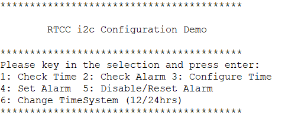
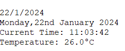
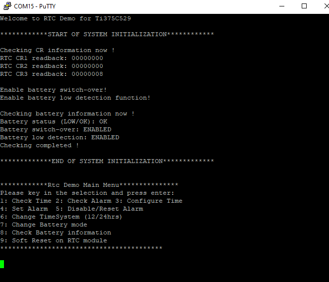
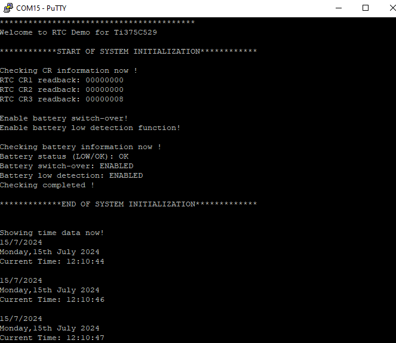
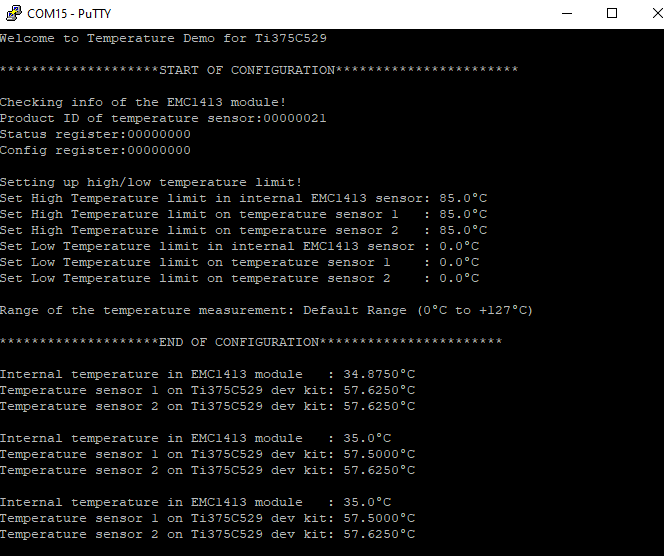

# Sensors

This guide show on how to run the sensors application on baremetal. 

## sensor_DS3231_rtc
This example design utilize I2C peripheral to communicate with DS3231 RTC sensor and run it on baremetal.

### Supported Feature		
* Time Keeping
* 12/24hr Time System
* Temperature Sensor
* Alarms 1 and 2	
* Power Failure Check and Clear

* Note: Please set ENABLE_SEMIHOSTING_PRINT to 0 in bsp.h

###  Usage
1. In Efinity RISC-V IDE, open the main.c from sensor_DS3231_rtc.
2. Run the project by right click sensor_DS3231_rtc.launch where xxx can be as trion or titanium run as sensor_DS3231_rtc.

There are two ways of using RTC in the example design:
* At default setting, main menu is enabled to allow user to configure time, alarm, etc in terminal. This required the user to enabled UART at first place.

    

* User can also disable mainu menu to allow the time shown in terminal every few seconds depending on the configuration. 

    
    
## sensor_PCF8523_rtc

This example design utilize I2C peripheral to communicate with PCF8523 RTC sensor and run it on baremetal.

### Supported Feature		
* Time Keeping
* 12/24hr Time System
* Temperature Sensor
* Alarms 1 and 2	
* Power Failure Check and Clear

* Note: Please set ENABLE_SEMIHOSTING_PRINT to 0 in bsp.h

###  Usage
1. In Efinity RISC-V IDE, open the main.c from rtcDemo.
2. Run the project by right click rtcDemo_ti.launch, run as rtcDemo_ti.

There are two ways of using RTC in the example design:
* At default setting, main menu is enabled to allow user to configure time, alarm, etc in terminal. This required the user to enabled UART at first place.

    

* User can also disable main menu to allow the time shown in terminal every few seconds depending on the configuration. 

    

## sensor_EMC1413_temp

This example design utilize I2C peripheral to communicate with EMC1413 Temperature sensor and run it on baremetal.

### Supported Feature		
* Printout current temperature of the device on terminal every seconds.
* Alert user if the temperature exceeds temperature threshold set.

###  Usage
1. In Efinity RISC-V IDE, open the main.c from temperatureSensorDemo.
2. Run the project by right click temperatureSensorDemo_ti.launch, run as temperatureSensorDemo_ti.

Terminal shall print the following; 

