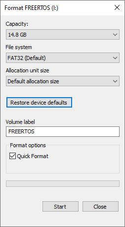
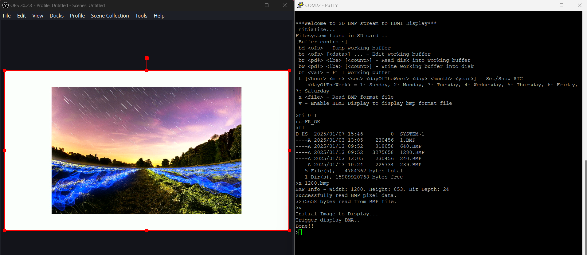

# Solution

This guide show on how to run the solution application on baremetal. 
Below are the solution-related application:
  - [cameraStreaming_HDMI](ug_solution.md#camerastreaming_hdmi)
  - [sd_bmpStreaming_HDMI](ug_solution.md#sd_bmpstreaming_hdmi)

## cameraStreaming_HDMI
The ``cameraStreaming_HDMI`` example design demonstrates a use case of hardware/software co-design for video processing within a camera and display system. This design showcases how users can control the FPGA hardware via software, enabling different hardware acceleration functions by modifying the firmware on the RISC-V processor.

Though the example focuses on video filtering functions, users can replace these with their own hardware acceleration blocks. This design provides an effective framework for accelerating computationally intensive functions in hardware, while using RISC-V software to manage and control the acceleration.

List of implemented ISP algorithms (available for both SW functions and HW modules):
- RGB to grayscale conversion
- Sobel edge detection -> Performs edge detection.
- Binary dilation      -> Removes line detail by ANDing all windowed pixels.
- Binary erosion       -> Strengthens line detail by ORing all windowed pixels. 

## sd_bmpStreaming_HDMI
This example design ``sd_bmpStreaming_HDMI`` demonstrates the implementation of the FatFS FileSystem with a Command Line Interface (CLI) for interaction. The disk IO layer is ported to the SD Host Controller. Upon execution, the example initializes the SD Host Controller and the FAT File System automatically. Additionally, the FatFSDemo is integrated with the Real-Time Clock (RTC) available on board. User can configure the RTC using the rtcDemo provided within the BSP. In addition, User able to read BMP file and stream the image file to HDMI Display.

### Introduction of FatFs
FAT File System, commonly known as FatFs, is a lightweight and versatile file system module designed for embedded systems and small microcontrollers. In this demo, it support both SPI and SD interface thru command line where APB3 Port 1 used for configuring the interface, 0: SPI Interface; 1: SD Interface. This demo require a micro sd card and pmod micoSd for Trion T120F576 Development kit. 

### Preparation

1. Format the SD card to FAT32.   

2. Copy random BMP format file to SD card. 

### FatFS Command Line Interface

- Disk Controls (d*) 
    - `di 0` 
        - Initialize the disk
    - `dd 0 < sector number >` 
        - Dump the specific sector number
    - `ds 0`
        - Show the disk status 

- Buffer Control (b*) 
    - Buffer control is the command line to access the buffer
    - `bd 0`
        - Dump the working buffer
    - `be 0 <data>` 
        - Edit the working buffer 
    - `br 0 <sector number> <Number of data>` 
        - Read disk into the working buffer 
    - `bw 0 <sector number> <Number of data>`
        - Write working buffer into disk 
    - `bf 0`
        - Fill the working buffer
    
- File System Control (f*) 
    - File system related command line
    - `fi 0 1`
        - Force the volume to initialize
    - `fs`
        - Show the volume status
    - `fl <path>`
        - `<path>` is omittable
        - Show the items in the current or `<path>` directory
    - `fo <mode> <file>`
        - Open a file in specific mode
            - Mode 0 => Open existing file 
            - Mode 1 => Open as read file 
            - Mode 2 => Open as write file 
            - Mode 4 => Create a new file 
            - Mode 8 => create a new file always
            - Mode 16 => Open a file always 
            - Mode 48 => Open a file append
    > Note: Always close the file after open. Else it might corrupt the file 
    - `fc` 
        - Close the file 
    - `fe 0`
        - Mode fp in normal seek 
    - `fd <len>`
        - Dump the data in a file assuming the file is opened in read mode  
        - `<len>` Number of byte of data to dump 
    - `fr <len>`
        - Read the data in a file assuming the file is opened in read mode 
        - `<len>` Number of byte of data to read
    - `fw <len> <val>`
        - Write same value, `<val>` multiple time based on the `<len>`
    - `fn <original name> <new name>`
        - Rename an object
    - `fu <object name>`
        - Unlink/ Delete an object(can be a file or directory)
    - `fv`
        - Truncate the file at the current pointer
    - `fk <directory name>`
        - Create a new directory
    - `fa <atrr> <mask> <object name>`
        - Change the attribute of an object
    - `ft <year> <month> <day> <hour> <min> <sec> <name>`
        - Set the timestamp to the RTC if all the arguments are loaded
    - `fx <source file> <destination file>`
        - Copy file
    - `fg <path>`
        - Change the current directory
    - `fq`
        - Show the current directory
    - `fb <name>`
        - Set the volume label 
    - `fm 0 <type> <size>`
        - Create a file system 
        - `<size>` The size of the file system
        - `<type>` Type of the file system 
            - 0x01 => FAT
            - 0x02 => FAT32
            - 0x04 => EXFAT
            - 0x07 => ANY
            - 0x08 => SDF 
    - `fz <len>`
        - If `<len>` argument are provided, it will change the R/W length for fr/fw/fx command 
        - If not provided, it will show the R/W length for fr/fw/fx command 
- Miscellaneous Control (m*) 
    - `md[b|h|w] <addr> [<count>]`
        - Dump the memory
        - `mdw` => Dump memory in word format 
        - `mdh` => Dump memory in hexadecimal format
        - `mdb` => Dump memory in binary format 
    - `mf <addr> <value> <count>`
        - Fill memory 
        - `<addr>` => The address to fill the memory 
        - `<value>` => The value of data to fill the memory 
        - `<count>` => Number of byte to write
    - `<me[b|h|w] <addr> [<value> ...]`
        - Edit memory 
        - `meb` => Edit memory in binary format
        - `meh` => Edit memory in hexadecimal format
        - `mew` => Edit memory in word format
- RTC Control (c*)
    - `t [<year> <mon> <day> <dayofweek> <hour> <min> <sec>] - Set/Show RTC * "
	" e.g t 2024 2 26 2 13 40 50 - > 26/2/2024, 13:40:50 `
        - Set/ Show the Real Time Clock (RTC) 
- Read BMP format image file
	- ` x <file> ` - Read BMP format file
	- ` v ` - Display bmp format file to HDMI Display
  - ` z ` - Flush Image Buffer

### Stream BMP file to HDMI Display

1. To stream a BMP file to the display, type ``fi 0 1`` in the terminal to initialize the volume after launching the app.

2. Ensure that there is a BMP-format file on the SD card.

3. Type ``x <file>`` to read the BMP file.
    - ``Do not display an image where its resolution is larger than the display (1280x720).``
4. Type ``v`` to copy the pixel data from the BMP file to the HDMI display.

5. The image will be displayed on the HDMI screen.     

