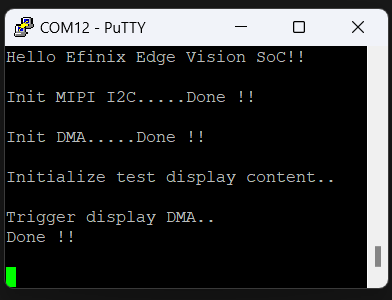
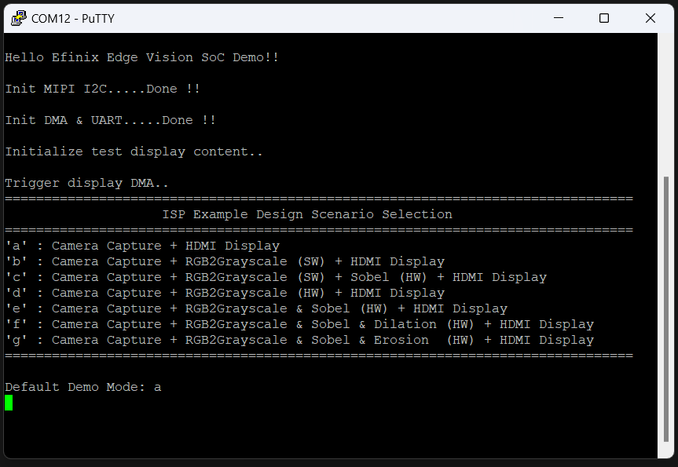
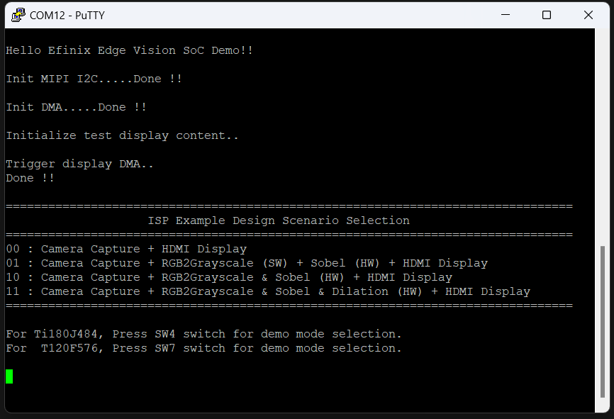
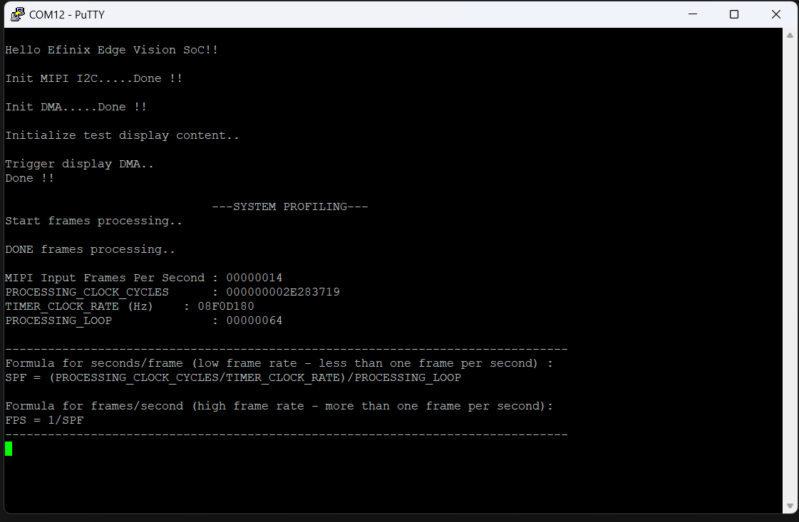
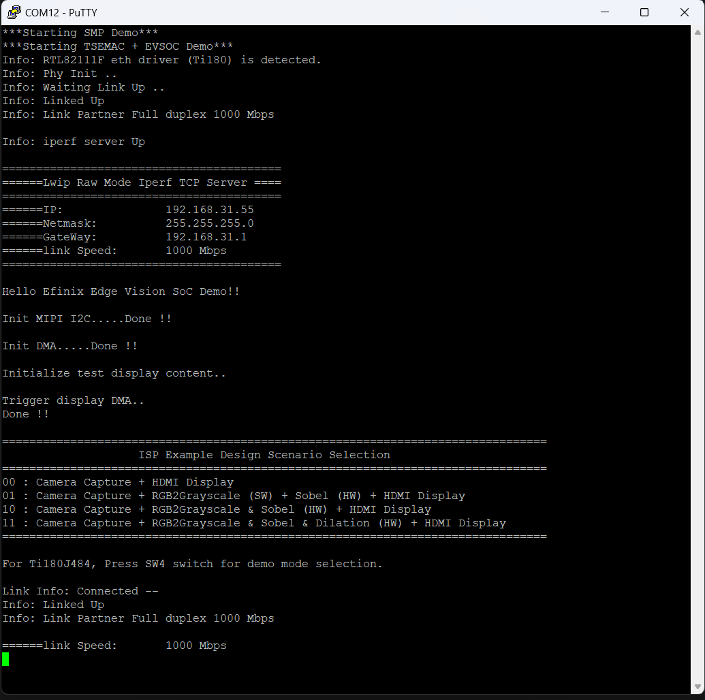
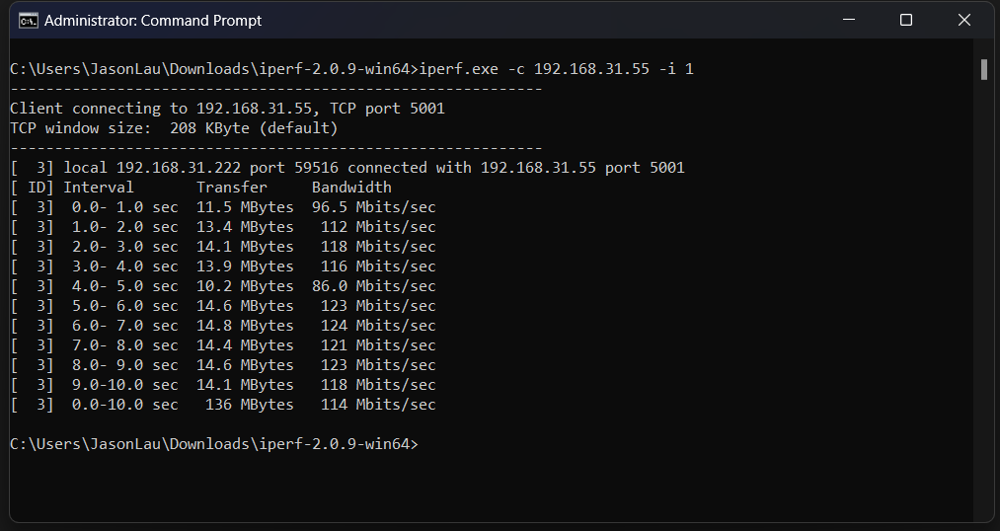

# Vision

This guide show on how to run the vision application on baremetal. 
Below are the vision-related application:
  - [cam_display_demo](ug_vision.md#cam_display_demo)
  - [cam_display_uart_control_demo](ug_vision.md#cam_display_uart_control_demo)
  - [cam_display_sw_control_demo](ug_vision.md#cam_display_sw_control_demo)
  - [cam_display_simulation](ug_vision.md#cam_display_simulation)
  - [cam_display_profiling](ug_vision.md#cam_display_profiling)
  - [cam_display_iperf_demo](ug_vision.md#cam_display_iperf_demo)
  
## cam_display_demo
The camera & display example design demonstrates a use case of hardware/software co-design for video processing within a camera and display system. This design showcases how users can control the FPGA hardware via software, enabling different hardware acceleration functions by modifying the firmware on the RISC-V processor.

Though the example focuses on video filtering functions, users can replace these with their own hardware acceleration blocks. This design provides an effective framework for accelerating computationally intensive functions in hardware, while using RISC-V software to manage and control the acceleration.

List of implemented ISP algorithms (available for both SW functions and HW modules):
- RGB to grayscale conversion
- Sobel edge detection -> Performs edge detection.
- Binary dilation      -> Removes line detail by ANDing all windowed pixels.
- Binary erosion       -> Strengthens line detail by ORing all windowed pixels. 

## cam_display_uart_control_demo
This example design is the improved version of the cam_display_demo where it allow user to enable ISP algorithms such as RGB to grayscale conversion through RISC-V and hardware accelerator by using UART command on terminal.
With this method, user can view the different acceleration options without recompiling the software code. 

## cam_display_sw_control_demo
This example design is similar to cam_display_demo except user can control the hardware acceleration function using switches on the development board.
- For Titanium, press SW4 to switch different mode.
- For Trion, press SW7 for different mode.

## cam_display_simulation
This example is used for image signal processing simulation only. 

## cam_display_profiling
This example is similar to cam_display_demo except it adds a frame counter and a timestamp to count the processing frame rates of the different scenarios.

## cam_display_iperf_demo
This example design is the combination of cam_display_sw_control_demo and lwipIperfserver demo where it uses multicore feature which Core 0 demonstrate cam_display_sw_control_demo ,allowing user to control the hardware acclerator's mode  and present
the video filtering function to hdmi display while Core 1 is establising an iperf server to test the overall bandwith. 

### Preparation
Before launching the application, users are encouraged to go through [lwipIperfServer](ug_ethernet.md#lwipiperfserver) for setting up the Host IP before proceed here. 

1. Make sure right click cam_display_iperf_XXX_mc.launch where XXX is Trion and Titanium to use multicore to run the application. 
2. After launching the application, user should see the following messages in the serial terminal:

    

3. User should able to use switch to control the hardware accelerator to present different video output.
    For Ti375C529, press SW4 to configure the demo mode. 
    For Ti180J484, press SW4 to configure the demo mode. 
    For T120F576 , press SW7 to configure the demo mode. 

4. Open a second terminal or command prompt.
5. Change to the directory where it has the iPerf2 executable.
6. Type the command:

    `` .\iperf.exe -c 192.168.31.55 -i 1 ``
    
User should see output similar to the following in the terminal:

  

Below are the performance for each devices:
| Device       | Speed(Mbps) -TX  |   Speed(Mbps) -RX   | Display Resolution |
|--------------|------------------|---------------------|--------------------|
| Ti180J484    |       119        |          --         |        720p        |
| T120F576     |       26.8       |          --         |        720p        |