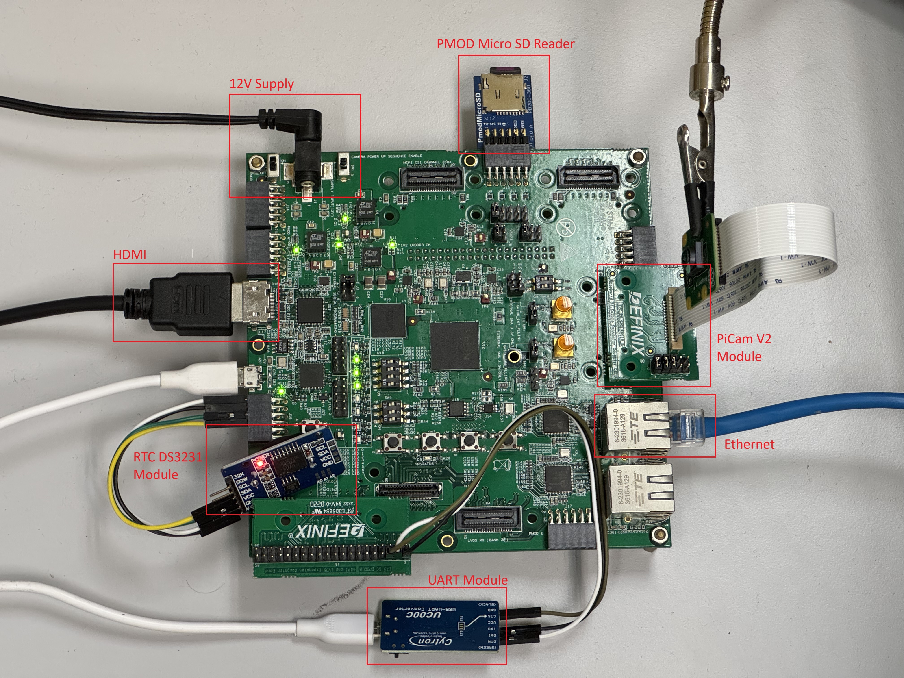
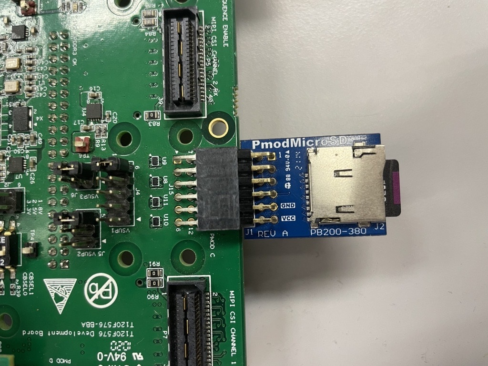

# Setup Development Board: Trion T120F576

This guide show on how to setup the development board with required card module. This setup only applicable for Trion T120F576 development board.

## Overall hardware required: 
Essential Hardware needed in the following:
- UART module
- MIPI and LVDS Expansion Daughter
- Two micro USB cable
- Universal AC to DC power adapter

Ethernet related hardware needed in the following:
- LAN cable

Vision related hardware are needed in the following:
- Raspberry Pi v2 Camera Module
- Raspberry Pi Camera Connector Daughter Card
- HDMI cable

SD related hardware are needed in the following:
- DS3231 RTC Sensor
- Micro SD card less than 32GB
- Pmod Micro SD card reader

## Steps for connecting the hardware to T120F576 Development Board. 
1. Hardware connection for UART module through MIPI LVDS Daughter Card(P3): 
* Connect TX of the UART module to pin 2 of the MIPI LVDS Daughter Card.
* Connect RX of the UART module to pin 4 of the MIPI LVDS Daughter Card.
* Connect GND of the UART module to pin 6 of the MIPI LVDS Daughter Card.

2. Hardware connection for RTC DS3231 module through PMOD(J18): 
* Connect SCL of the DS3231 to pin 3
* Connect SDA of the DS3231 to pin 4 
* Connect GND of the DS3231 to pin 5 
* Connect VCC of the DS3231 to pin 6 

3. Hardware connection for Vision:
* Connect the Raspberry Pi v2 camera module to the daughter card using the 15-pin flat cable.
* Attach the Raspberry Pi Camera Connector Daughter Card to the P9 connector of the Trion T120F576 Development Board.
* Connect HDMI Cable to the HDMI Connector Daughter Card.

4. Hardware Connection for Ethernet:
* Connect Ethernet Cable to J21 ethernet port.
* Make sure the connected ethernet cable is CAT 5E. 

5. Hardware Connection for pmod microsd reader 
* Connect pin 1(CS) of the Pmod MicroSD to pin 1 of the J15.
* Connect pin 2(CMD) of the Pmod MicroSD to pin 2 of the J15.
* Connect pin 3(DAT0) of the Pmod MicroSD to pin 3 of the J15.
* Connect pin 4(SCLK) of the Pmod MicroSD to pin 4 of the J15.
* Connect pin 5(GND) of the Pmod MicroSD to pin 5 of the J15.
* Connect pin 6(VCC) of the Pmod MicroSD to pin 6 of the J15.

6. Ensure all boards have the followings jumper settings:
* On header J10, connect pins 2 - 3 with a jumper (default) to use the on-board 30MHz oscillator.
* On header J12, connect pins 2 - 3 (default) to use the on-board 10MHz oscillator.
* On header J2 and J3, connect pins 1 - 2 (default).
* On rasphberry pi camera daugher card, connect pins 1-2, 3-4, and 5-6 with three jumpers. 
* Connect jumpers to set the camera power sequence:
 * VSUP1 (J4)—Connect pins 5 - 6 or 9 - 10 (default)
 * VSUP2 (J5)—Connect pins 5 - 6 (default)
 * VSUP3 (J6)—Connect pins 3 - 4 (default)
* Slide SW1 to position 3, which enables the power up sequence circuit for the MIPI CSI-2 cameras.