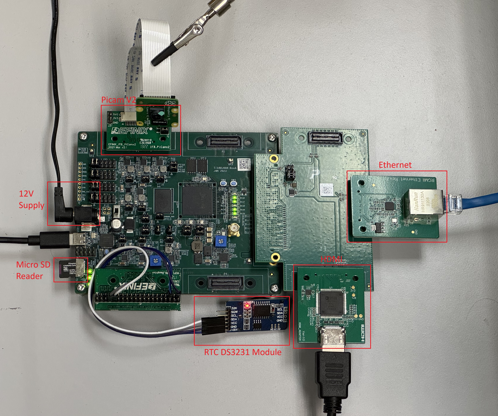

# Setup Development Board: Titanium Ti180J484

This guide show on how to setup the development board with required card module. This setup only applicable for Titanium Ti180J484 development board.

## Overall hardware required: 
Essential Hardware needed in the following:
- USB type-C cable 
- Universal AC to DC power adapter

Ethernet related hardware needed in the following:
- FMC-to-QSE Adapter Card
- Ethernet Connector Daughter Card
- LAN cable

Vision related hardware are needed in the following:
- Raspberry Pi v2 Camera Module
- Dual Raspberry Pi Camera Connector Daughter Card
- FMC-to-QSE Adapter card
- HDMI Connector Daughter Card
- HDMI cable

SD related hardware are needed in the following:
- MIPI and LVDS Expansion Daughter
- DS3231 RTC Sensor
- Micro SD card less than 32GB

## Steps for connecting the hardware to Ti180J484 Development Board. 

1. Hardware connection for RTC DS3231: (Required a MIPI daughter expansion card to be attached on P2 )
* Connect SCL of the DS3231 to pin32 (P2)
* Connect SDA of the DS3231 to pin34 (P2)
* Connect GND of the DS3231 to pin5 (P2)
* Connect VCC of the DS3231 to pin1 (P2)

2. Hardware connection for Micro SD Card:
* Simply attach micro sd card to the on-board micro SD slot of Ti180J484. 

3. Hardware connection for Ethernet:
* Attach FMC-to-QSE Adaptor to the J5 of the Ti180J484.
* Attach Ethernet Connector Daughter card to J2 of the FMC-to-QSE Adaptor.
* Connect ethernet cable from Ethernet Connector Daughter card to the computer.
* Make sure the connected ethernet cable is CAT 5E. 

4. Hardware Connection for Vision:
* Connect the Raspberry Pi v2 camera module to the daughter card using the 15-pin flat cable.
* Attach the Dual Raspberry Pi Camera Connector Daughter Card to the P1 connector of the Titanium Ti180J484 Development Board.
* Attach the HDMI Connector Daughter Card to the J1 connector of the FMC to QSE Adaptor. 
* Connect HDMI Cable to the HDMI Connector Daughter Card.

5. Ensure all boards have the followings jumper settings:

| **Board**                            | **Header**                  | **Pins to Connect**                               |
|--------------------------------------|-----------------------------|---------------------------------------------------|
| Titanium Ti180J484 Development Board | J9                                                                               | N.C.                                               |
|                                      | J10, J11, J12, J13, PT1, PT17                                                    | 1 - 2 and 3 - 4                                    |
|                                      | PT2, PT3, PT4, PT5, PT6, PT7, PT8, PT9, PT10, PT11, PT12, PT13, PT14, PT15, PT16 | 1 - 2                                              |
| FMC-to-QSE Adapter Card              | J5                                                                               | 5 - 6 and 7 - 8                                    |
| Dual Raspberry PiCam Daughter Card   | J1                                                                               | 1 - 2, 3 - 4, 5 - 6, 7 - 8, 9 - 10, and 11 - 12    |
