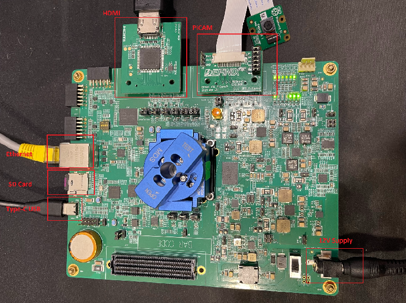

# Setup Development Board: Titanium Ti375C529 Dev Kit

This guide show on how to setup the development board with required daughter cards. This setup only applicable for Titanium Ti375C529 development board.

## Overall hardware required: 
---
Essential Hardware needed in the following:
- USB Type-C cable 
- Universal AC to DC power adapter 12V Output

Ethernet related hardware needed in the following:
- LAN cable CAT 5e and above (To support 1000mbps ethernet)

Vision related hardware are needed in the following:
- Raspberry Pi v2/v3 Camera Module
- Efinix's Dual Raspberry Pi Camera Connector Daughter Card
- HDMI Connector Daughter Card v1.0 and above
- HDMI cable connecting to a HDMI display

SD related hardware are needed in the following:
- Micro SD card less than 32GB storage size

## Steps for connecting the hardware to Ti375C529 Development Board. 
---
1. Hardware connection for Micro SD Card:
* Simply attach micro sd card to the on-board micro SD slot of Ti375C529 at SD1. 

3. Hardware connection for Ethernet:
* Connect ethernet cable to RJ1 port of the Ti375C529. 
* Connect the other end of the ethernet cable to your machine.
* Make sure the connected ethernet cable is CAT 5E and above. 

4. Hardware Connection for Vision:
* Connect the Raspberry Pi v2 camera module to the PiCAM-V2 daughter card using the 15-pin flat cable.
* Attach the Dual Raspberry Pi Camera Connector Daughter Card to the P2 connector of the Titanium Ti375C529 Development Board.
* Attach the HDMI Connector Daughter Card to the P1 connector of the Titanium Ti375C529 Development Board.
* Connect HDMI Cable to the HDMI Connector Daughter Card.

5. Ensure all boards have the followings jumper settings:

| **Board**                            | **Header**                  | **Pins to Connect**                               |
|--------------------------------------|-----------------------------|---------------------------------------------------|
| Titanium Ti180J484 Development Board | J20, J1, J8, J21, J3, J24, PJ17, J4, J9, J5, PJ4, J11, J16     | N.C.           |
|                                      | PJ18, PJ13, PJ11, PJ16, PJ12, PJ7 ,PJ6 ,PJ14 , PJ9, PJ8, PJ5   | 1 - 2          |
| Dual Raspberry PiCam Daughter Card   | P2                         | 1 - 2, 3 - 4, 5 - 6, 7 - 8, 9 - 10, and 11 - 12    |
