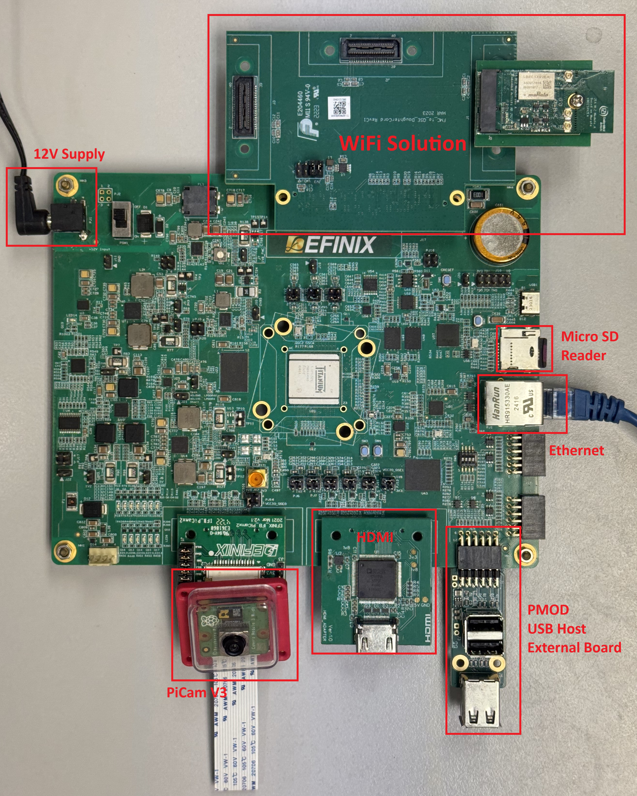

# Setup Development Board: Titanium Ti375C529 Dev Kit

This guide show on how to setup the development board with required daughter cards. This setup only applicable for Titanium Ti375C529 development board.

## Hardware Requirements

### Core Components
The following items are strictly required to operate the board:
* **USB Type-C cable**
* **Universal AC to DC power adapter** (12V Output)

### Expansion & Interface Hardware
Depending on the specific interfaces you intend to use, you will need the corresponding hardware below:

* **Ethernet**
  * LAN cable (CAT 5e or above to support 1000 Mbps)
* **Vision / Display**
  * Raspberry Pi Camera Module (v2 or v3)
  * Efinix Dual Raspberry Pi Camera Connector Daughter Card
  * HDMI Connector Daughter Card (v1.0 or higher)
  * HDMI cable and an HDMI-compatible display
* **Storage**
  * Micro SD card (Capacity must be less than 32GB)
* **USB Controller**
  * PMOD 4-Port USB Host External Board 
  * *Resource:* [Schematic and manufacturing files](../../hw/efinix/PMOD-USB-Ext-Board/)
* **WiFi Solution**
  * FMC to QSE Adapter Card
  * WiFi Module
  * QSE M2 External Board (*Resource:* [Schematic and manufacturing files](../../hw/efinix/QSE-M2-Ext-Board/))
  * *Resource:* Refer to the [br2-efinix repository](https://github.com/Efinix-Inc/br2-efinix) for extended details such as jumper configuration.

## Hardware Setup: Ti375C529 Development Board

Follow these steps to connect the required hardware interfaces to the development board:

**1. Micro SD Card**
* Insert the Micro SD card into the on-board **SD1** slot of the Ti375C529. 

**2. Ethernet**
* Connect a CAT 5e (or higher) Ethernet cable to the **RJ1** port on the board. 
* Connect the other end of the cable to your host machine.

**3. Vision & Display**
* Connect the Raspberry Pi v2 camera module to the PiCAM-V2 daughter card using the 15-pin flat cable.
* Attach the Dual Raspberry Pi Camera Connector Daughter Card to the **P2** connector on the development board.
* Attach the HDMI Connector Daughter Card to the **P1** connector on the development board.
* Connect an HDMI cable from the HDMI daughter card to your display.

**4. USB Controller**
* Plug the PMOD 4-Port USB Host External Board directly into the **J15** PMOD port.

**5. Jumper Configuration**
Ensure all boards are configured with the following jumper settings before powering on:

| **Board** | **Header** | **Pins to Connect** |
| :--- | :--- | :--- |
| Titanium Ti37C529 Development Board | J20, J1, J8, J21, J3, J24, PJ17, J4, J9, J5, PJ4, J11, J16 | N.C. (Not Connected) |
| | PJ18, PJ13, PJ11, PJ16, PJ12, PJ7, PJ6, PJ14, PJ9, PJ8, PJ5 | 1 - 2 |
| Dual Raspberry PiCam Daughter Card | P2 | 1-2, 3-4, 5-6, 7-8, 9-10, and 11-12 |
