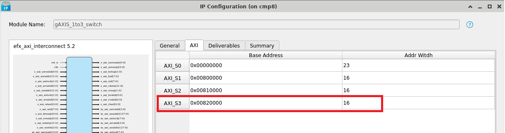
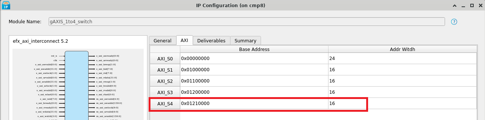
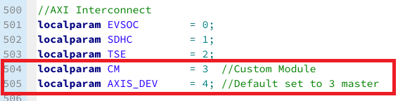
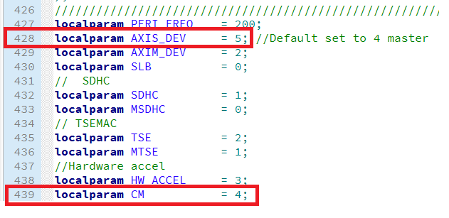
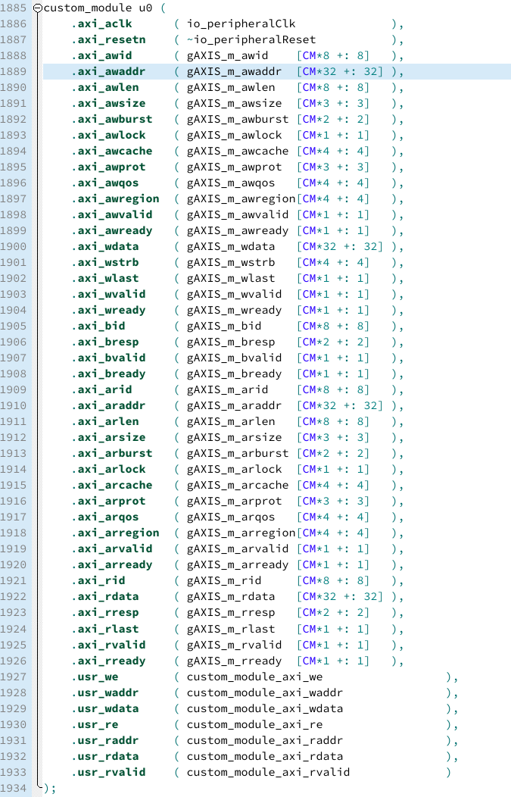
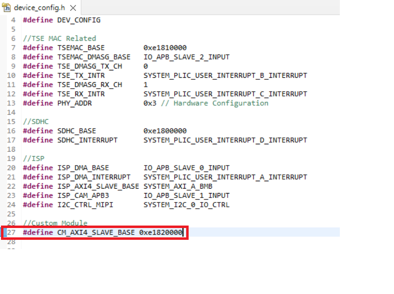
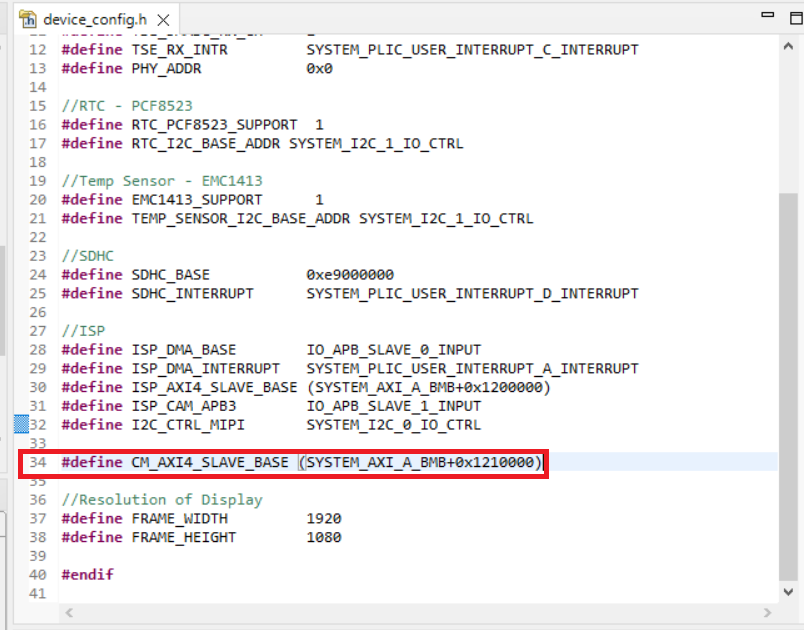
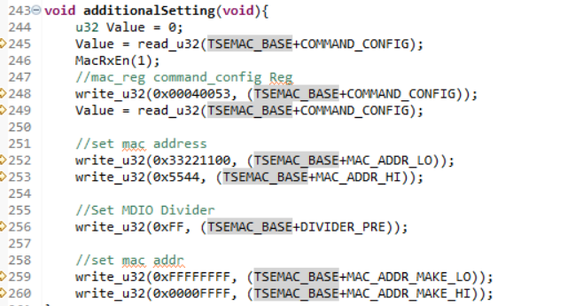
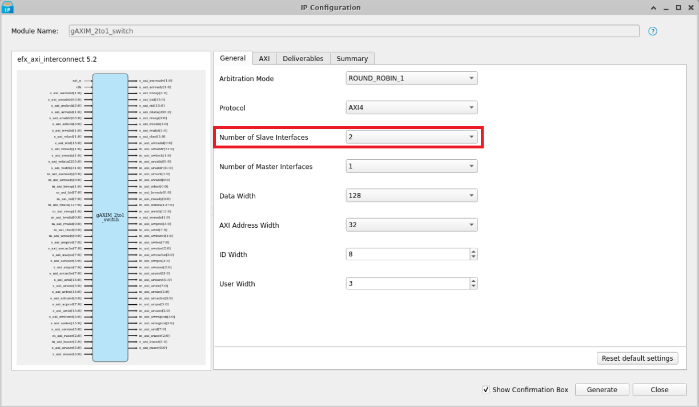
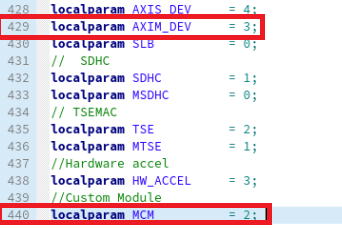

# Expanding the Embedded Solution Platform 

This guide showcase how user can integrate their own module into Embedded Solution Platform. 

<br>

## Workflow to expand AXI Slave interface with additional Custom Module 

### AXI Interconnect IP Configuration
1. Search for gAXIS_1to3_switch in Soft Sapphire Soc Project.
2. Right click to configure it.
3. Change the number of master and number of slaves depending on user's requirements.

> Note: User may find gAXIS_1to4_switch IP in High Performance Sapphire Soc instead. 


#### Soft Sapphire SoC
Following are the module that uses AXI Interconnect (gAXIS_1to3_switch) in Embedded Solution Platform:
* AXI_S0 : Vision Hardware Accelerator
* AXI_S1 : SD Host Controller
* AXI_S2 : TSEMAC



Users may set the base address of the AXI_S3 to 0x00820000 while the address width is depending on user's requirement.  

#### Sapphire High Performance SoC
Following are the module that uses AXI Interconnect (gAXIS_1to4_switch) in Embedded Solution Platform:
* AXI_S0 : Soft Logic Block (SLB)
* AXI_S1 : SD Host Controller
* AXI_S2 : TSEMAC
* AXI_S3 : Vision Hardware Accelerator




Users may set the base address of the AXI_S4 to 0x1210000 while the address width is depending on user's requirement.  

### RTL Design

In terms of RTL Design, user are required to redefine the depth of the AXI- Interconnect and define the CM for AXI- Interconnect. 

#### Soft Sapphire SoC
 


#### Sapphire High Performance SoC




Below show the example of adding custom module into the top RTL design. 




### Embedded Software

To access the specific AXI Slave in the embedded_sw, user are required to access the correct base address. User may add the base address in the include/device_config.h.

#### Soft Sapphire SoC
 


#### Sapphire High Performance SoC



You can now access the AXI Slave similar to how the TSE slave is being accessed. You would just need to modify the argument from TSEMAC_BASE to CM_AXI4_SLAVE_BASE. 




<br>

## Workflow to expand AXI Master interface with additional Custom Module 

### AXI Interconnect IP Configuration
1. Search for gAXIM_2to1_switch in Sapphire High Performance SoC.
2. Right click to configure it.
3. Change the number of master and number of slaves depending on user's requirements.



> Note: Sapphire SoC design does not include AXI Interconnect in the design. User may include one based on the Sapphire High Performance SoC design. 


Following are the module that uses AXI Interconnect (gAXIM_2to1_switch) in Embedded Solution Platform (HPS design only):
* AXI_M0 : SD Host Controller
* AXI_S1 : TSEMAC




### RTL Design

In the top module, user are required to redefine the depth of the AXI Interconnect and define the MCM for AXI Interconnect.

``` 
    custom_module u0 (
        .clk                     ( io_ddrMasters_0_clk ),
        .reset                   ( io_ddrMasters_0_reset ),
        .ctrl_clk                ( io_peripheralClk ),
        .ctrl_reset              ( io_peripheralReset ),
        .ctrl_PADDR              ( custom_module_paddr ),
        .ctrl_PREADY             ( custom_module_pready ),
        .ctrl_PENABLE            ( custom_module_penable ),
        .ctrl_PSEL               ( custom_module_psel ),
        .ctrl_PWRITE             ( custom_module_pwrite ),
        .ctrl_PWDATA             ( custom_module_pwdata ),
        .ctrl_PRDATA             ( custom_module_prdata ),
        .ctrl_PSLVERROR          ( custom_module_pslverror ),
        .ctrl_interrupts         ( dma_interrupts ),
        .read_arvalid            ( gAXIM_s_arvalid[MCM*1 +: 1] ),
        .read_araddr             ( gAXIM_s_araddr[MCM*32 +: 32] ),
        .read_arready            ( gAXIM_s_arready[MCM*1 +: 1] ),
        .read_arregion           ( gAXIM_s_arregion[MCM*4 +: 4] ),
        .read_arlen              ( gAXIM_s_arlen[MCM*8 +: 8] ),
        .read_arsize             ( gAXIM_s_arsize[MCM*3 +: 3] ),
        .read_arburst            ( gAXIM_s_arburst[MCM*2 +: 2] ),
        .read_arlock             ( gAXIM_s_arlock[MCM*2 +: 2] ),
        .read_arcache            ( gAXIM_s_arcache[MCM*4 +: 4] ),
        .read_arqos              ( gAXIM_s_arqos[MCM*4 +: 4] ),
        .read_arprot             ( gAXIM_s_arprot[MCM*4 +: 4] ),
        .read_rready             ( gAXIM_s_rready[MCM*1 +: 1] ),
        .read_rvalid             ( gAXIM_s_rvalid[MCM*1 +: 1] ),
        .read_rdata              ( gAXIM_s_rdata[MCM*128 +: 128] ),
        .read_rlast              ( gAXIM_s_rlast[MCM*1 +: 1] ),
        .read_rresp              ( gAXIM_s_rresp[MCM*2 +: 2] ),
        .write_awvalid           ( gAXIM_s_awvalid[MCM*1 +: 1] ),
        .write_awready           ( gAXIM_s_awready[MCM*1 +: 1] ),
        .write_awaddr            ( gAXIM_s_awaddr[MCM*32 +: 32] ),
        .write_awregion          ( gAXIM_s_awregion[MCM*4 +: 4] ),
        .write_awlen             ( gAXIM_s_awlen[MCM*8 +: 8] ),
        .write_awsize            ( gAXIM_s_awsize[MCM*3 +: 3] ),
        .write_awburst           ( gAXIM_s_awburst[MCM*2 +: 2] ),
        .write_awlock            ( gAXIM_s_awlock[MCM*2 +: 2] ),
        .write_awcache           ( gAXIM_s_awcache[MCM*4 +: 4] ),
        .write_awqos             ( gAXIM_s_awqos[MCM*4 +: 4] ),
        .write_awprot            ( gAXIM_s_awprot[MCM*4 +: 4] ),
        .write_wvalid            ( gAXIM_s_wvalid[MCM*1 +: 1] ),
        .write_wready            ( gAXIM_s_wready[MCM*1 +: 1] ),
        .write_wdata             ( gAXIM_s_wdata[MCM*128 +: 128] ),
        .write_wstrb             ( gAXIM_s_wstrb[MCM*16 +: 16] ),
        .write_wlast             ( gAXIM_s_wlast[MCM*1 +: 1] ),
        .write_bvalid            ( gAXIM_s_bvalid[MCM*1 +: 1] ),
        .write_bready            ( gAXIM_s_bready[MCM*1 +: 1] ),
        .write_bresp             ( gAXIM_s_bresp[MCM*2 +: 2] ),
        .dat1_o_clk              ( io_custom_module_clk ),
        .dat1_o_reset            ( io_custom_module_reset),
        .dat1_o_tvalid           ( custom_module_tx_tvalid ),
        .dat1_o_tready           ( custom_module_tx_tready ),
        .dat1_o_tdata            ( custom_module_tx_tdata ),
        .dat1_o_tkeep            ( custom_module_tx_tkeep ),
        .dat1_o_tdest            ( custom_module_tx_tdest ),
        .dat1_o_tlast            ( custom_module_tx_tlast ),
        .dat0_i_clk              ( io_custom_module_clk ),
        .dat0_i_reset            ( io_custom_module_reset ),
        .dat0_i_tvalid           ( custom_module_rx_tvalid ),
        .dat0_i_tready           ( custom_module_rx_tready ),
        .dat0_i_tdata            ( custom_module_rx_tdata ),
        .dat0_i_tkeep            ( 1'b1),
        .dat0_i_tdest            ( custom_module_rx_tdest ),
        .dat0_i_tlast            ( custom_module_rx_tlast ),
        .io_1_descriptorUpdate   (  ),
        .io_0_descriptorUpdate   (dma_tx_descriptorUpdate)
    
    );   
```


## Embedded Software

With the addition of the AXI Interconnect, the embedded software can now accommodate an additional master capable of reading from and writing to the main memory through the SoC's AXI Master interface. If the custom module you've added is a DMA controller, you can leverage it to perform memory operations via APB3 control.