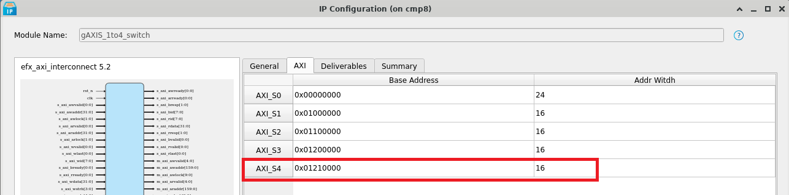
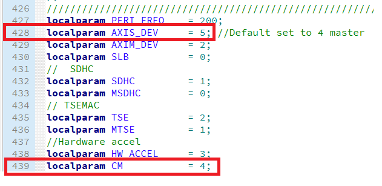
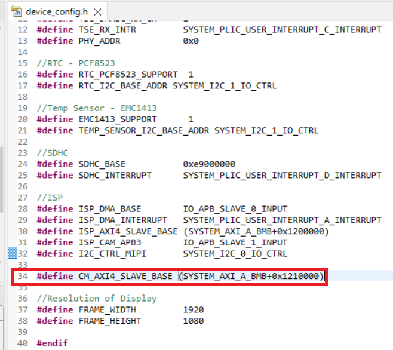
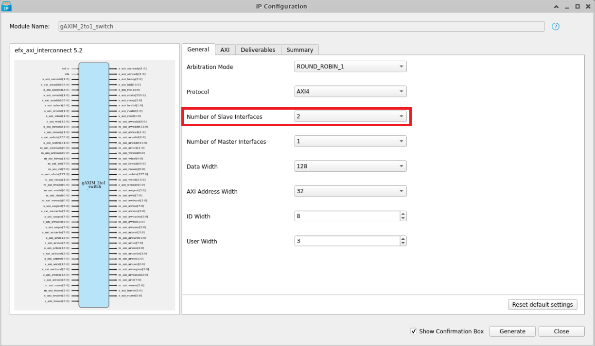
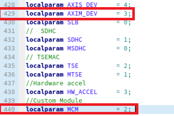

# Expanding the Embedded Solution Platform 

This guide showcase how user can integrate their own module into Embedded Solution Platform. 

## Workflow to Expand AXI Slave Interface with an Additional Custom Module (HPS)

### AXI Interconnect IP Configuration
1. Search for `gAXIS_1to4_switch` in the High Performance Sapphire SoC Project.
2. Right-click to configure it.
3. Change the number of masters and slaves depending on your requirements.
   

4. The following modules use the AXI Interconnect `gAXIS_1to4_switch` in the Embedded Solution Platform:
    * AXI_S0: Soft Logic Block (SLB)
    * AXI_S1: SD Host Controller
    * AXI_S2: TSEMAC
    * AXI_S3: Vision Hardware Accelerator  
   

**Note:** Users may set the base address of the AXI_S4 to `0x1210000`, while the address width depends on your requirements.

---

### Top SoC Verilog File

1. For the top SoC Verilog file, you are required to redefine the depth of the AXI Interconnect and define the CM for the AXI Interconnect.  
   <br> 

2. Add the custom module to the top SoC Verilog file. Below is an example of adding a custom module into the top SoC module:  
   <br> 

### Embedded Software

1. To access the specific AXI slave in the embedded software, you must access the correct base address. Add the base address in the `include/device_config.h`.  
   <br> 

2. You can now access the AXI slave similar to how the TSE slave is accessed. Modify the argument from `TSEMAC_BASE` to `CM_AXI4_SLAVE_BASE`.

---


## Workflow to expand AXI Master interface with additional Custom Module (HPS)

### AXI Interconnect IP Configuration
1. Search for gAXIM_2to1_switch in Sapphire High Performance SoC.
2. Right click to configure it.
3. Change the number of master and number of slaves depending on user's requirements. 

4. Following are the module that uses AXI Interconnect (gAXIM_2to1_switch) in Embedded Solution Platform (HPS design only):
    * AXI_M0 : SD Host Controller
    * AXI_S1 : TSEMAC <br>
    

---

### Top Soc Verilog File

In the top module, user are required to redefine the depth of the AXI Interconnect and define the MCM for AXI Interconnect.

```verilog
custom_module u0 (
    .clk                     ( io_ddrMasters_0_clk ),
    .reset                   ( io_ddrMasters_0_reset ),
    .ctrl_clk                ( io_peripheralClk ),
    .ctrl_reset              ( io_peripheralReset ),
    .ctrl_PADDR              ( custom_module_paddr ),
    .ctrl_PREADY             ( custom_module_pready ),
    .ctrl_PENABLE            ( custom_module_penable ),
    .ctrl_PSEL               ( custom_module_psel ),
    .ctrl_PWRITE             ( custom_module_pwrite ),
    .ctrl_PWDATA             ( custom_module_pwdata ),
    .ctrl_PRDATA             ( custom_module_prdata ),
    .ctrl_PSLVERROR          ( custom_module_pslverror ),
    .ctrl_interrupts         ( dma_interrupts ),
    ...
);
```

### Embedded Software

With the addition of the AXI Interconnect, the embedded software can now accommodate an additional master capable of reading from and writing to the main memory through the SoC's AXI Master interface. If the custom module you've added is a DMA controller, you can leverage it to perform memory operations via APB3 control.
