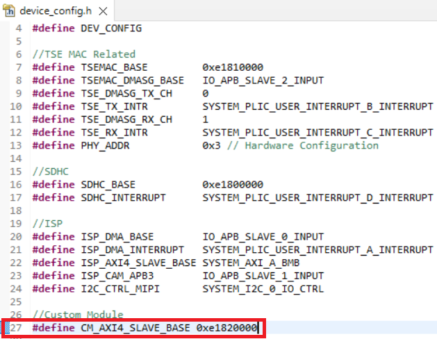

# Expanding the Embedded Solution Platform 

This guide showcase how user can integrate their own module into Embedded Solution Platform. 

## Workflow to expand AXI Slave interface with additional Custom Module

### AXI Interconnect IP Configuration
1. Search for ``gAXIS_1to3_switch`` in Soft Sapphire Soc Project.
2. Right click to configure it.
3. Change the number of master and number of slaves depending on user's requirements.  

4. Following are the module that uses AXI Interconnect ``gAXIS_1to3_switch`` in Embedded Solution Platform:
    * AXI_S0 : Vision Hardware Accelerator
    * AXI_S1 : SD Host Controller
    * AXI_S2 : TSEMAC
    

Note: User may set the base address of the AXI_S3 to ``0x00820000`` while the address width is depending on user's requirement.  

---

### Top Soc Verilog File

1. For the top soc verilog file, user are required to redefine the depth of the AXI- Interconnect and define the CM for AXI- Interconnect. 
  

2. Add the custom module to the top soc verilog file, below show the example of adding custom module into the top soc module.   

---

### Embedded Software

1. To access the specific AXI Slave in the embedded_sw, user are required to access the correct base address. User may add the base address in the include/device_config.h.   

2. User can now access the AXI Slave similar to how the TSE slave is being accessed. You would just need to modify the argument from TSEMAC_BASE to CM_AXI4_SLAVE_BASE.   