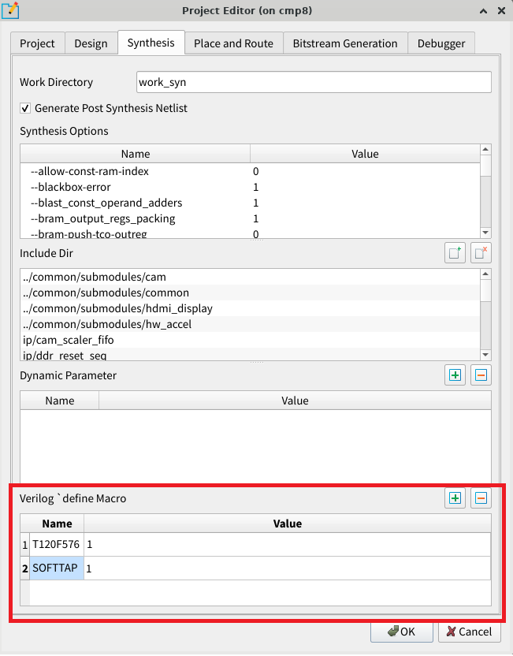
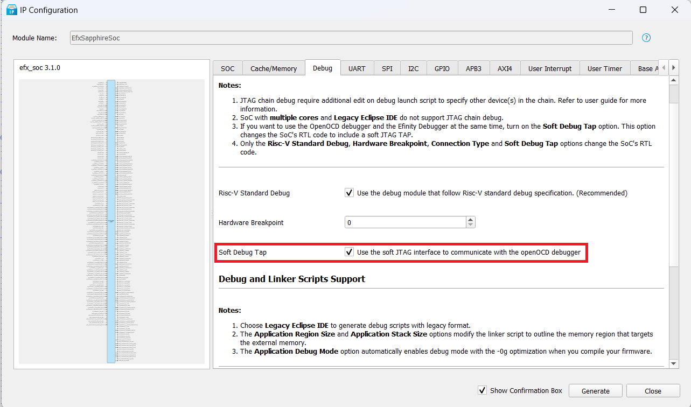
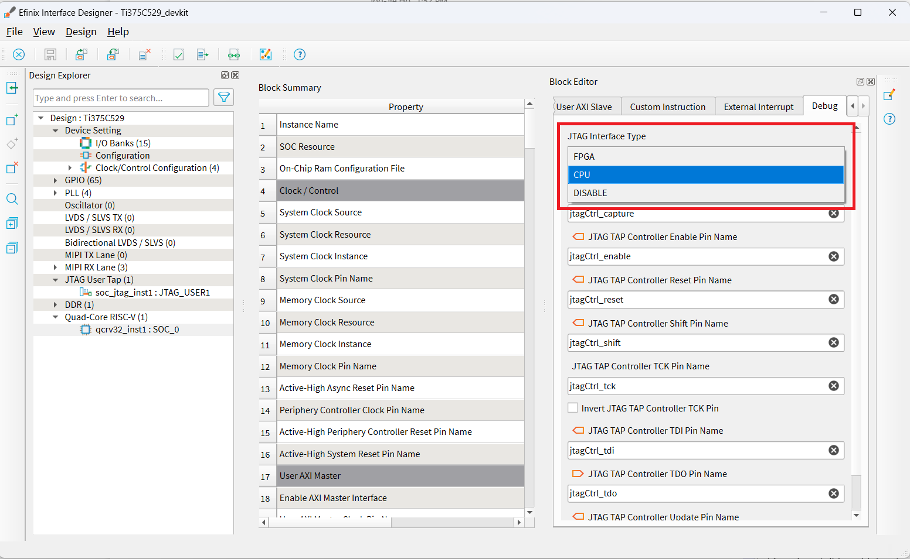
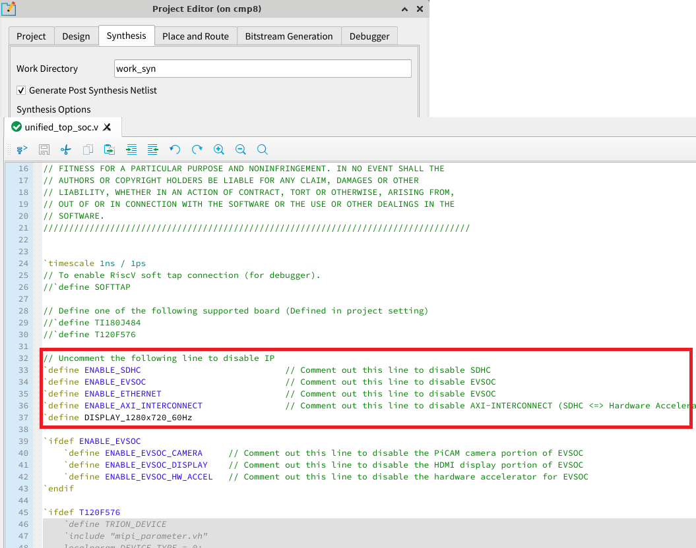

# RTL Design Description
In this repo, there are two top soc verilog file which is used in Soft Sapphire Soc devices and High Performance Sapphire Soc device respectively. 

* The top level RTL design file of the Soft Sapphire Soc is located at [top_soc.v](../../sapphire_soc/common/top_soc.v)

* The top level RTL design file of the High Performance Sapphire Soc is located at [top_soc.v](../../hps_soc/common/top_soc.v)

# Soft Sapphire Soc Devices

User can find soft sapphire soc project at here [sapphire_soc](../../sapphire_soc/)

## How to Enable Soft Tap

1. To enable Soft Tap, users are encouraged to use project editor  by clicking "File" and "Edit Project" to define "SOFTTAP" at the last row of the Synthesis Tab as shown below:

### Soft Sapphire Soc: Regenerate Sapphire Soc with Soft Tap enabled.

To enable soft Tap, user are required to regenerate Soft Sapphire Soc in IPM. 

1. Right click on the IP: EfxSapphireSoc and configure the IP.

2. Enable Soft Tap Debug on Debug tab of the IP Configuration and click "Generate". 

3. Recompile the project. 

#### High Performance Sapphire Soc

To enable Soft Tap, user are not required to regenerate SLB for High Performance Sapphire Soc.

1. Open Efinity Interface Designer and change the JTAG Interface type from "FPGA" to "CPU" on Debug tab

3. Click generate "Generate Efinity Constraint Files" and compile the project. 

## Enable/Disable current IP

Users are allowed to enable/disable current existing IP for testing or replace user's IP with current IP by uncommenting the following line. 

> To expand your current design, refers to the [platform expansion](./platform-expansion.md)