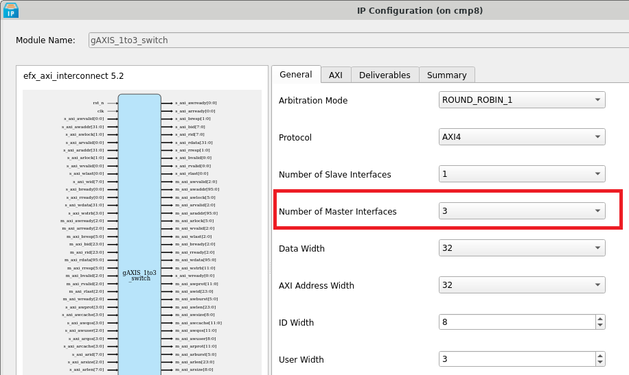
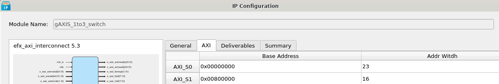

# Enable/Disable Existing IP in Embedded Solution 

This guide demonstrates how to correctly disable an existing IP and recompile the project. 

## Disable Vision Hardware Accelerator in Sapphire Soc

### AXI Interconnect IP Configuration
1. Based on the [Address Mapping](../../../soc/addr_mapping_soc.md), the Vision Hardware Accelerator is connected to the master interface of the AXI Interconnect `gAXIS_1to3_switch` at the address `SYSTEM_AXI_A_BMB + 0xe1200000`, where `SYSTEM_AXI_A_BMB = 0xe1000000`.

2. Configure `gAXIS_1to3_switch` by reducing the number of master interfaces.   
   

3. The `AXI_S3` interface will be disabled. Below is the updated list of modules using the `gAXIS_1to3_switch` in the Embedded Solution Platform:
    * AXI_S0 : Vision Hardware Accelerator
    * AXI_S1 : SD Host Controller
    * AXI_S2 : TSEMAC
   

4. Generate the updated IP configuration.

---

### Top SoC Verilog File

1. To disable the existing IP for the Vision Hardware Accelerator, uncomment the `ENABLE_EVSOC` line in the Verilog file:  
   

2. Recompile the project to apply the changes.

---

**Note:**  
After disabling the specified IP, ensure that the AXI Slave Address in `include/device_config.h` is correctly updated to reflect the changes.