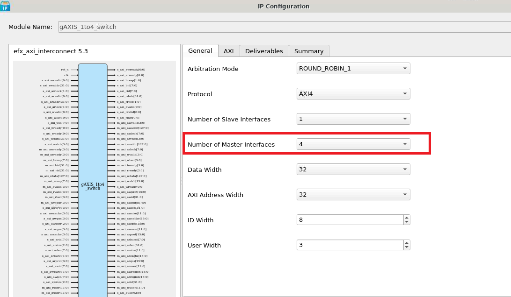
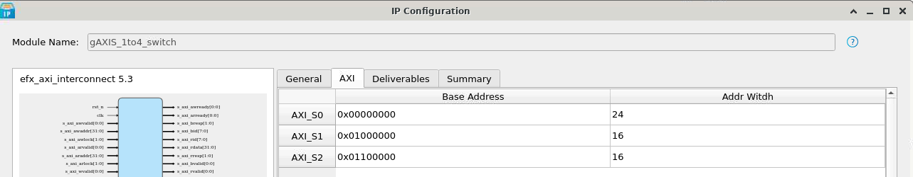
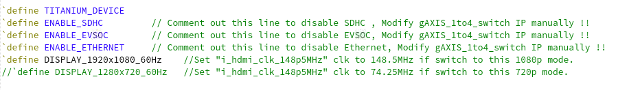
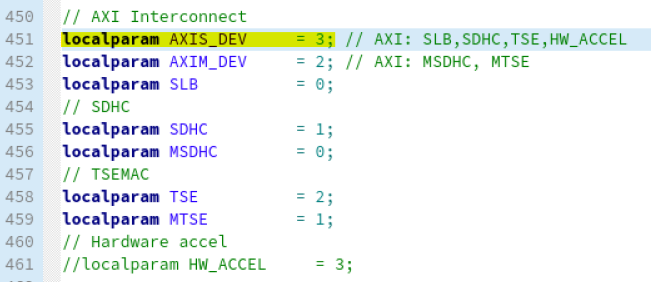

# Enable/Disable Existing IP in Embedded Solution 

This guide demonstrates how to correctly disable an existing IP and recompile the project. 

## Disable Vision Hardware Accelerator in High-Performance SoC (HPS)

### AXI Interconnect IP Configuration
1. Based on the [Address Mapping](../../../soc/addr_mapping_soc.md), the Vision Hardware Accelerator is connected to the master interface of the AXI Interconnect `gAXIS_1to4_switch` at the address `SYSTEM_AXI_A_BMB + 0xe1200000`, where `SYSTEM_AXI_A_BMB = 0xe8000000`.

2. Configure `gAXIS_1to4_switch` by reducing the number of master interfaces.  
   

3. The `AXI_S3` interface will be disabled. Below is the updated list of modules using the `gAXIS_1to4_switch` in the Embedded Solution Platform:
   * `AXI_S0` : Soft Logic Block (SLB)
   * `AXI_S1` : SD Host Controller
   * `AXI_S2` : TSEMAC
   * `AXI_S3` : Vision Hardware Accelerator  
   

4. Generate the updated IP configuration.

---

### Top SoC Verilog File

1. To disable the existing IP for the Vision Hardware Accelerator, uncomment the `ENABLE_EVSOC` line in the Verilog file:  
   

2. Make sure the number/depth of the axi interconnect `gAXIS_1to4_switch` is set correctly. At default, the AXIS_DEV is set to 4.

   | AXIS_DEV of the ``gAXIS_1to4_switch`` | Module| localparam |
   |--------------|------------------|------------------|
   | AXIS_S0 | Soft Logic Block|SLB |
   | AXIS_S1 | SD host Controller|SDHC|
   | AXIS_S2 | TSEMAC|TSE|
   | AXIS_S3 | Vision Hardware Accelerator| HW_ACCEL|
   
     

3. Make sure to change ``AXIM_DEV`` if user want to disable ethernet or sdhc IP.

   | AXIM_DEV of the ``gAXIS_1to2_switch`` | Module|localparam|
   |--------------|------------------|------------------|
   | AXIS_M0 | SD host Controller|MSDHC|
   | AXIS_M1 | TSEMAC|MTSE|

3. Recompile the project to apply the changes.

---

**Note:**  
After disabling the specified IP, ensure that the AXI Slave Address in `include/device_config.h` is correctly updated to reflect the changes.
