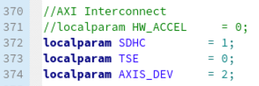
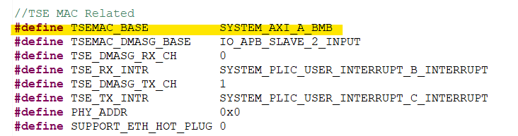

# Enable/Disable Existing IP in Embedded Solution 

This guide demonstrates how to correctly disable an existing IP and recompile the project. 

## Disable Vision Hardware Accelerator in Sapphire Soc

### AXI Interconnect IP Configuration
1. Based on the [Address Mapping](../../../soc/addr_mapping_soc.md), the Vision Hardware Accelerator is connected to the master interface of the AXI Interconnect `gAXIS_1to3_switch` at the address `SYSTEM_AXI_A_BMB + 0xe1200000`, where `SYSTEM_AXI_A_BMB = 0xe1000000`.

2. Configure `gAXIS_1to3_switch` by reducing the number of master interfaces.   
   

3. The `AXI_S0` interface will be replaced with TSEMAC. Below is the updated list of modules using the `gAXIS_1to3_switch` in the Embedded Solution Platform:
    * AXI_S0 : ``Vision Hardware Accelerator`` <=``TSEMAC``
    * AXI_S1 : SD Host Controller
   

4. Generate the updated IP configuration.

---

### Top SoC Verilog File

1. To disable the existing IP for the Vision Hardware Accelerator, uncomment the `ENABLE_EVSOC` line in the Verilog file:    

2. Make sure the number/depth of the axi interconnect `gAXIS_1to4_switch` is set correctly. At default, the AXIS_DEV is set to 3.

   | AXIS_DEV of the ``gAXIS_1to3_switch`` | Module| localparam |
   |--------------|------------------|------------------|
   | AXIS_S0 | Vision Hardware Accelerator SD |HW_ACCEL |
   | AXIS_S1 | SD host Controller | SDHC |
   | AXIS_S2 | TSEMAC| TSE| 
   
     

3. In this case of disabling vision related IP, user can replace `AXIS_S0` with `TSEMAC` as mentioned previosly so that the ``AXIS_S2`` can be removed. The AXIS_DEV is reduced to 2. 

4. Recompile the project to apply the changes.

---

### Embedded Software

1. After disabling the specified IP, ensure that the AXI Slave Address in `include/device_config.h` is correctly updated to reflect the changes.

2. Here is the example on redefining the ``TSEMAC_BASE`` on ``include/device_config.h`` after disabling vision related IP :
  