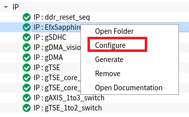
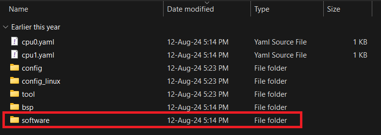
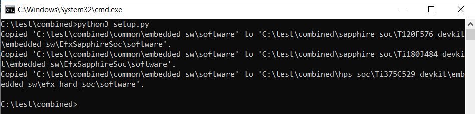
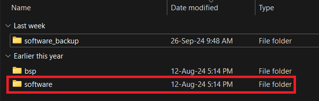

# Regenerate Soc
This guide explain how user can reconfigure the Sapphire Soc and run the available software application that provided in this repo correctly. 

## Regenerate Soft Sapphire Soc
1. As usual, the user is allowed to reconfigure and generate the Sapphire SoC based on the user's preferences, as shown below:  
                     

2. After the generation of Sapphire Soc is completed, user will notice an additional folder named as "software" in the example path:
``/home/user SapphireSoC_SW_Demo/sapphire_soc/T120F576_devkit/embedded_sw/EfxSapphireSoc``: 

3. Remove the software folder. 

4. Users are required to run the [setup.py](../../setup.py) again to copy over the [software application](../../common/embedded_sw/software/) to the device by typing the command on terminal: 

    `` python3 setup.py  ``

5. Users should see output similar to the following in the terminal: 

P/S: User is required to recompile the project once the soc is regenerated. 

## Regenerate High Performance Sapphire Soc
1. User is allowed to reconfigure and generate the High Performance Sapphire Soc based on the user's preferences, as shown below: 

2. After the generation of High Performance Sapphire Soc is completed, user will notice an additional folder named as "software" in the example path:
``/home/user SapphireSoC_SW_Demo/hps_soc/Ti375C529_devkit/embedded_sw/efx_hard_soc``: 

3. Remove the software folder. 

4. Users are required to run the [setup.py](../../setup.py) again to copy over the [software application](../../common/embedded_sw/software/) to the device by typing the command on terminal: 

    `` python3 setup.py  ``

5. Users should see output similar to the following in the terminal: 

P/S: User is required to recompile the project once the soc is regenerated. 
